# Bildiri Kitabı

Bildiri Kitabı, aynı etkinliğe ait on Word (.docx) bildirisini tek bir PDF e-kitapta birleştiren bir web uygulamasıdır. Kitapta kapak, gerçek başlangıç sayfalarını gösteren bir İçindekiler ve tutarlı sayfa numaraları bulunur; e-posta adresleri ile telefon numaraları sunucu tarafında temizlenir, sonuç tarayıcıdaki görüntüleyicide açılır ve indirilir.

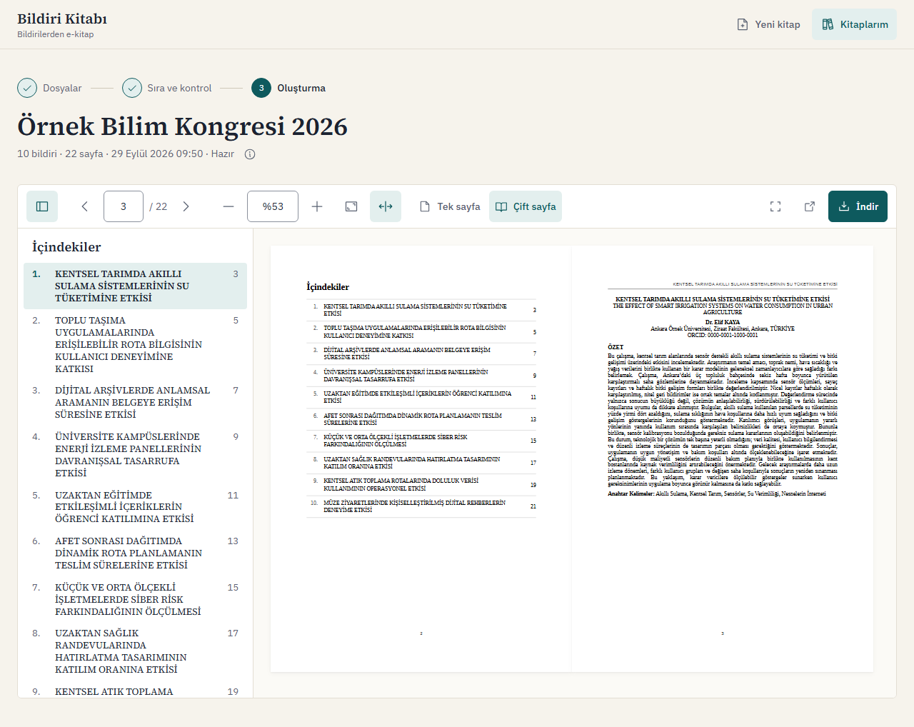

## İçindekiler

1. [Kabul kriterleri](#kabul-kriterleri)
2. [Hızlı başlangıç (Docker)](#hizli-baslangic)
3. [Docker olmadan çalıştırma](#docker-olmadan)
4. [Mimari](#mimari)
5. [İşleme akışı](#isleme-akisi)
6. [Veri modeli](#veri-modeli)
7. [Dosya saklama yaklaşımı](#dosya-saklama)
8. [Word → PDF işleme](#word-pdf)
9. [İletişim bilgisi temizliği](#iletisim-temizligi)
10. [Kuyruk ve arka plan işleme](#kuyruk)
11. [Arayüz ve tasarım kararları](#arayuz)
12. [API](#api)
13. [Testler](#testler)
14. [Kullanılan kütüphaneler ve lisanslar](#kutuphaneler)
15. [Güvenlik notları](#guvenlik)
16. [Bilinen eksikler ve sınırlamalar](#bilinen-eksikler)
17. [Yapay zekâ kullanımı](#yapay-zeka)
18. [Proje yapısı](#proje-yapisi)

<a id="kabul-kriterleri"></a>

## Kabul kriterleri

| Kriter | Nasıl karşılanıyor | Doğrulayan testler |
|---|---|---|
| Yüklenen Word belgeleri tek bir PDF olarak oluşturuluyor | On bildiri belirlenen sırayla okunur, temizlenir ve QuestPDF ile tek belgede dizilir; her bildiri yeni sayfada başlar. | `BookEndToEndTests.Every_paper_is_reproduced_word_for_word_without_contact_values`, `GenerationTests.Generation_runs_in_the_background_and_stores_page_numbers`, E2E `mutlu yol` |
| İçindekiler'deki her başlık doğru başlangıç sayfasını gösteriyor | Sayfa numarası QuestPDF'in bölüm (section) özelliğiyle dizgi sırasında hesaplanır; tahmin yoktur. Satırlar ilgili sayfaya bağlantıdır. | `BookEndToEndTests.Every_table_of_contents_entry_points_to_the_page_where_the_paper_starts`, `RendererAndLeakScannerTests.Paper_page_ranges_follow_explicit_page_breaks`, E2E `mutlu yol` (beşinci bildiri 11. sayfada) |
| Kitap sayfalarında tutarlı sayfa numaraları var | Basılı numara, PDF'teki fiziksel sayfa sırasıdır; kapak 1 sayılır ama numarası basılmaz. | `BookEndToEndTests.Every_page_after_the_cover_shows_its_physical_page_number` |
| E-posta ve telefonlar PDF'te görünmüyor, diğer içerik aynen korunuyor | Sunucu tarafında değer tespiti ve temizlik; üretim sonrası PDF metni ayrıca taranır. | `ContactInfoSanitizerTests`, `BookEndToEndTests.Book_contains_no_email_addresses_or_turkish_phone_numbers`, `BookEndToEndTests.Orcid_identifiers_are_kept` |
| React arayüzü masaüstünde ve dar mobil ekranda temel akışı sunuyor | Tüm akış 1280 px masaüstü ve 390 px telefon görünümünde çalışır; yatay kaydırma yoktur, dokunma hedefleri en az 44 px'tir. | `frontend/e2e/book.spec.ts` (`desktop` ve `mobile` projeleri), E2E `düzen: yatay kaydırma yok ve dokunma hedefleri en az 44 px` |
| MSSQL şeması migration ile kuruluyor, iki tablo arasındaki ilişki çalışıyor | EF Core migration'ları `Kitaplar` ve `Bildiriler` tablolarını, yabancı anahtarı (silmede cascade), benzersiz indeksleri ve CHECK kısıtlarını kurar. | `SchemaAndUploadTests.Migration_creates_the_tables_keys_and_constraints_on_an_empty_database`, `SchemaAndUploadTests.Check_constraints_reject_a_completed_book_without_pdf_and_a_failed_book_without_message`, `LifecycleTests.Delete_removes_the_book_papers_and_files_but_not_while_it_is_processing` |
| Dosya saklama yaklaşımı çalışıyor ve açıklanıyor | `wwwroot` dışında, sistem üretimli anahtarlarla ve atomik yazımla yerel dosya deposu; ayrıntı [Dosya saklama yaklaşımı](#dosya-saklama) bölümünde. | `LocalFileStorageTests`, `SchemaAndUploadTests.Invalid_uploads_are_rejected_with_their_codes_and_leave_no_trace` |
| Bekleme, başarılı sonuç ve hata durumları arayüzde görülüyor | Üretim ekranı gerçek aşamaları ve yüzdeyi gösterir; tamamlanınca görüntüleyici açılır; hata ekranı anlaşılır mesaj, tekrar dene ve sırayı düzenle seçenekleri sunar. | E2E `bekleme ekranı erişilebilir`, E2E `üretim hatası: hata ekranı, tekrar dene ve sırayı düzenle`, `BookPage.test.tsx` |
| Oluşturma başarısız olursa kitabın durumu `Failed` oluyor | Her hata `Durum = 'Failed'`, `HataKodu` ve Türkçe `HataMesaji` ile kaydedilir; veritabanı kısıtı mesajsız `Failed` kaydına izin vermez. | `LifecycleTests.A_renderer_failure_marks_the_book_failed_and_a_retry_completes_it`, `LifecycleTests.A_generation_that_exceeds_the_time_limit_fails_with_a_timeout_code`, `RendererAndLeakScannerTests.Generation_fails_with_contact_leak_code_when_the_rendered_pdf_still_contains_contact_values` |
| Tam olarak 10 adet .docx yükleniyor; dosya adı ve sıra görülüyor | Hem arayüzde hem sunucuda sayı, tür, boyut ve mükerrer kontrolü; ikinci adımda dosya adı, tespit edilen başlık ve sıra listelenir, sıra her satırdaki Yukarı / Aşağı düğmeleriyle değiştirilir. | `BookUploadValidatorTests.Nine_files_are_rejected`, `SchemaAndUploadTests.Ten_sample_papers_create_a_book_with_ordered_papers_and_detected_titles`, E2E `istemci doğrulaması: eksik dosya, yanlış tür ve mükerrer dosya` |
| PDF web arayüzünde görüntüleniyor ve indiriliyor | react-pdf (pdf.js) tabanlı görüntüleyici; İçindekiler paneli, sayfa gezinme, yakınlaştırma, tek/çift sayfa ve indirme. | E2E `mutlu yol`, E2E `görüntüleyici: varsayılan açılış, ortalanmış kapak, yakınlaştırma ve çift dokunma`, `PdfViewer.test.tsx` |

<a id="hizli-baslangic"></a>

## Hızlı başlangıç (Docker)

Gereksinim: Docker Desktop veya Docker Engine ile Docker Compose v2. SQL Server konteyneri için en az 2 GB boş bellek gerekir.

1. Depoyu klonlayın ve klasörüne geçin:

   ```sh
   git clone https://github.com/suleymank12/bildiri-kitabi.git
   cd bildiri-kitabi
   ```

2. Ortam dosyasını oluşturun:

   ```sh
   cp .env.example .env
   ```

   Windows PowerShell'de: `Copy-Item .env.example .env`

3. `.env` dosyasını açın ve `<...>` ile gösterilen üç parolayı doldurun (`MSSQL_SA_PASSWORD`, `APP_DB_PASSWORD`, `RABBITMQ_PASSWORD`). SQL Server parolaları en az 8 karakter olmalı ve büyük harf, küçük harf, rakam, simge gruplarından en az üçünü içermelidir (örnek biçim: `Kitap-2026-Parola`). Parolalarda `'`, `"`, `;`, `$` ve ters tırnak kullanmayın.

4. Sistemi derleyip başlatın:

   ```sh
   docker compose up --build -d
   ```

   İlk çalıştırmada imajlar indirilir ve derlenir (birkaç dakika sürer). SQL Server hazır olunca `db-init` servisi veritabanını ve uygulama girişini oluşturup çıkar; API açılışta migration'ları uygular.

5. Durumu kontrol edin; `mssql` ve `rabbitmq` `healthy`, `api` ve `web` `running` olmalıdır:

   ```sh
   docker compose ps
   ```

   Sağlık raporu: http://localhost:8080/health (`"status":"Healthy"`, veritabanı ve RabbitMQ kontrolleriyle).

6. Uygulamayı açın: http://localhost:8080

7. RabbitMQ yönetim arayüzü: http://localhost:15672 — kullanıcı adı ve parola `.env` içindeki `RABBITMQ_USER` ve `RABBITMQ_PASSWORD`. Üretim kuyruğu `bildiri-kitabi.uretim`, ölü mektup kuyruğu `bildiri-kitabi.uretim.dlq` adıyla görünür.

Durdurma ve temizleme:

```sh
docker compose stop      # konteynerleri durdurur, veriler kalır
docker compose down      # konteynerleri ve ağı kaldırır, veriler (volume'lar) kalır
docker compose down -v   # veritabanı, kuyruk ve üretilen PDF'ler dahil her şeyi siler
```

Yeniden başlatma desteklenir: `stop` ya da `down` sonrasında `docker compose up -d` (veya `docker compose start`) sistemi veriler korunarak yeniden açar; önceki kitaplar ve PDF'leri yerinde kalır.

Notlar:

- Yalnızca web arayüzü (8080) ve RabbitMQ yönetim arayüzü (15672) yayımlanır, ikisi de yalnızca `127.0.0.1` üzerinde. API ve veritabanı dışarıya açılmaz; tarayıcı API'ye nginx üzerinden ulaşır.
- Bu kurulum yerel değerlendirme içindir ve TLS içermez (bkz. [Bilinen eksikler](#bilinen-eksikler)).
- Apple Silicon (ARM): SQL Server imajı yalnızca `linux/amd64` olarak yayımlanır. Docker Desktop'ta "Use Rosetta for x86_64/amd64 emulation" seçeneği açıkken çalışır; diğer servisler ARM için yerel imaj kullanır.
- Uçtan uca testleri bu kuruluma karşı çalıştırmak için `.env` içinde `UPLOAD_RATE_LIMIT_PER_MINUTE=1000` ve `GENERATE_RATE_LIMIT_PER_MINUTE=1000` satırlarını açın, `docker compose up -d` ile API'yi yeniden oluşturun ve [Testler](#testler) bölümündeki `npm run test:e2e:docker` komutunu kullanın.

<a id="docker-olmadan"></a>

## Docker olmadan çalıştırma

### Gereksinimler

- .NET SDK 10.0.100 veya üstü (`backend/global.json` ile sabitlenmiştir)
- Node.js 22.12 veya üstü (önerilen sürüm `.nvmrc` içinde: 24)
- SQL Server: LocalDB, SQL Server Express/Developer veya Docker'da çalışan bir SQL Server
- İsteğe bağlı: RabbitMQ 4 (varsayılan kuyruk sağlayıcısı süreç içi kuyruktur)

### MSSQL bağlantısı

API bağlantı dizesini `ConnectionStrings:Default` anahtarından okur. `appsettings.Development.json` içindeki varsayılan LocalDB'dir; başka bir sunucu için dize ortam değişkeniyle veya user-secrets ile verilir (parolalar `appsettings` dosyalarına yazılmaz).

| Sunucu | Örnek bağlantı dizesi |
|---|---|
| LocalDB (varsayılan) | `Server=(localdb)\MSSQLLocalDB;Database=BildiriKitabi;Trusted_Connection=True;TrustServerCertificate=True` |
| SQL Server Express | `Server=localhost\SQLEXPRESS;Database=BildiriKitabi;Trusted_Connection=True;TrustServerCertificate=True` |
| Docker'daki SQL Server | `Server=localhost,1433;Database=BildiriKitabi;User Id=sa;Password=<parola>;TrustServerCertificate=True` |

Docker'daki SQL Server için örnek bir konteyner:

```sh
docker run -d --name bildiri-sql -e ACCEPT_EULA=Y -e "MSSQL_SA_PASSWORD=<parola>" -p 1433:1433 mcr.microsoft.com/mssql/server:2022-latest
```

User-secrets ile (yalnızca Development ortamında okunur):

```sh
cd backend
dotnet user-secrets set "ConnectionStrings:Default" "<bağlantı dizesi>" --project src/BildiriKitabi.Api
```

Ortam değişkeniyle (her ortamda geçerlidir, user-secrets'ı da geçersiz kılar):

```sh
# bash
export ConnectionStrings__Default="<bağlantı dizesi>"
# PowerShell
$env:ConnectionStrings__Default = "<bağlantı dizesi>"
```

### Veritabanı şeması

- Development ortamında API açılışta bekleyen migration'ları uygular (`Database:ApplyMigrationsOnStartup`).
- EF Core araçlarıyla elle:

  ```sh
  dotnet tool install --global dotnet-ef
  cd backend
  dotnet ef database update --project src/BildiriKitabi.Infrastructure --startup-project src/BildiriKitabi.Api
  ```

- EF araçları olmadan: [`backend/database/schema.sql`](backend/database/schema.sql) tüm migration'ları içeren, tekrar çalıştırılabilir (idempotent) bir betiktir; boş bir veritabanında SQL Server Management Studio, Azure Data Studio veya `sqlcmd -i` ile çalıştırılabilir.

### Backend ve frontend

```sh
# API: http://localhost:5080 (Development'ta API referansı: http://localhost:5080/scalar)
cd backend
dotnet run --project src/BildiriKitabi.Api

# Arayüz: http://localhost:5173 (/api ve /health istekleri 5080'deki API'ye yönlendirilir)
cd frontend
npm ci
npm run dev
```

### Kuyruk sağlayıcısı

`Queue:Provider` ayarı `InMemory` (varsayılan) veya `RabbitMq` olabilir. RabbitMQ için:

```sh
export Queue__Provider=RabbitMq
export RabbitMq__Host=localhost
export RabbitMq__Username=<kullanıcı>
export RabbitMq__Password=<parola>
```

RabbitMQ seçildiğinde kullanıcı adı ve parola zorunludur; `guest` hesabı reddedilir.

<a id="mimari"></a>

## Mimari

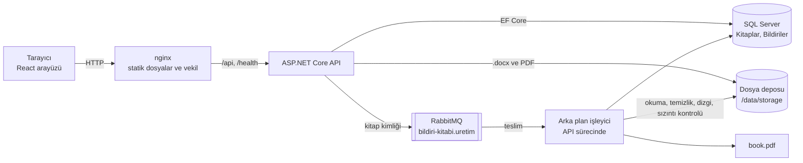

Katmanlar ve bağımlılık yönü `Api → Infrastructure → Core`:

| Katman | Sorumluluk |
|---|---|
| `BildiriKitabi.Core` | Etki alanı (`Book`, `Paper`, durumlar), belge modeli, iletişim bilgisi temizliği, başlık tespiti, yükleme doğrulaması, uygulama servisleri ve arayüzler (`IDocxReader`, `IFileStorage`, `IBookGenerationQueue` vb.). Hiçbir altyapı paketine (EF sağlayıcısı, OpenXML, QuestPDF, RabbitMQ) bağımlı değildir. |
| `BildiriKitabi.Infrastructure` | EF Core `DbContext`, yapılandırmalar ve migration'lar; OpenXML ile .docx okuma; QuestPDF ile dizgi; PdfPig ile sızıntı taraması; yerel dosya deposu; süreç içi ve RabbitMQ kuyruk sağlayıcıları; gömülü yazı tipleri. |
| `BildiriKitabi.Api` | Controller'lar, ProblemDetails hata biçimi, rate limiting, güvenlik başlıkları, sağlık kontrolü, arka plan işleyici, açılış kurtarması ve kuyruk süpürücüsü. |

API ve arka plan işleyici aynı süreçte çalışır; kuyruk bir arayüzün arkasında olduğundan işleyici ayrı bir sürece taşınabilir.

Docker'da açılış sırası: `mssql` sağlık kontrolü yalnızca bağlantı kabul edilmesine değil, `BildiriKitabi` veritabanı varsa gerçekten okunabilmesine (kurtarmanın bitmesine) bakar; `db-init` ve API bu kontrolden sonra başlar. `db-init` yine de SQL Server'a ulaşamazsa yaklaşık 60 sn boyunca 2 sn arayla yeniden dener (yanlış `sa` parolasında hemen durur). API de açılıştaki migration'dan önce veritabanını bekler: geçici SQL hatalarında üstel geri çekilmeyle yaklaşık 60 sn yeniden dener, kalıcı hatalarda (ör. hatalı giriş) hemen durur; bu sayede Docker veya bilgisayar yeniden başladığında API'nin SQL Server'dan önce kalkması sorun olmaz. Parolalar `sqlcmd`'ye komut satırıyla değil ortam değişkeniyle verilir. nginx API'nin adresini açılışta bir kez değil, Docker'ın DNS'i üzerinden çalışma anında çözer; yeniden başlatmalarda API'nin IP adresi değişse de web konteynerine dokunmadan çalışmaya devam eder.

<a id="isleme-akisi"></a>

## İşleme akışı

1. **Yükleme** — Arayüz kitap adını ve on dosyayı tek bir `multipart/form-data` isteğiyle gönderir; yükleme ilerlemesi gösterilir. Dosyalar önce geçici bir klasöre yazılır.
2. **Doğrulama** — Kitap adı, dosya sayısı, uzantı, ZIP imzası, Word ana parça türü, boyut sınırları, ZIP bombası ve mükerrer içerik (SHA-256) denetlenir. Tüm sorunlar dosya bazında, Türkçe mesajlarla tek seferde döner; hata varsa hiçbir kayıt veya dosya kalmaz.
3. **Başlık tespiti** — Her bildiri ayrıştırılır ve başlığı bulunur (sıra aşağıda); başlık ve kaynağı yanıtta döner.
4. **Kayıt** — Kitap ve bildiriler tek transaction'da kaydedilir, dosyalar kalıcı konumlarına taşınır. Kitabın durumu `Uploaded` olur.
5. **Sıra** — Varsayılan sıra yükleme sırasıdır. İkinci adımda her satırdaki Yukarı / Aşağı düğmeleriyle değiştirilebilir ve her değişiklik hemen kaydedilir; sıra yükleme sırasından farklıysa arayüz bunu belirtir.
6. **Kuyruk** — "Kitabı Oluştur" isteği kitabı `Queued` yapar ve kuyruğa yalnızca kitap kimliğini koyar; API hemen `202 Accepted` döner.
7. **Okuma** — İşleyici kitabı `Processing` olarak sahiplenir, bildirileri sırayla okuyup belge modeline çevirir.
8. **Temizlik** — Her paragraftan e-posta ve telefon değerleri ile bunlara bağlı etiketler ve ayırıcılar silinir; bildiri başına silinen sayılar kaydedilir.
9. **Dizgi** — Kapak, İçindekiler ve bildiriler QuestPDF ile tek PDF'te dizilir; bildirilerin başlangıç ve bitiş sayfaları kaydedilir.
10. **Sızıntı kontrolü** — Üretilen PDF'in metni PdfPig ile çıkarılıp e-posta ve telefon desenleriyle yeniden taranır. Eşleşme varsa PDF yayımlanmaz, kitap `Failed` (`CONTACT_LEAK_DETECTED`) olur.
11. **Kaydetme** — PDF atomik olarak depoya yazılır; kitap `Completed` olur, sayfa sayısı ve PDF boyutu kaydedilir. Arayüz durumu yoklayarak aşamaları gösterir ve tamamlanınca görüntüleyiciyi açar.

<a id="veri-modeli"></a>

## Veri modeli

Tablo ve kolon adları Türkçe, C# sınıfları İngilizcedir (`Book` → `Kitaplar`, `Paper` → `Bildiriler`); eşleme `IEntityTypeConfiguration` sınıflarında açıkça yapılır. Durum ve aşama değerleri metin olarak saklanır.

### `Kitaplar`

| Kolon | Tip | Açıklama |
|---|---|---|
| `Id` | `uniqueidentifier` PK | EF Core'un SQL Server için sıralı GUID üreticisi (SequentialGuidValueGenerator); Guid v7 SQL Server'ın uniqueidentifier sıralamasında sıralı olmadığı için kullanılmadı |
| `Ad` | `nvarchar(150)` | Kitap adı, kullanıcının yazdığı gibi |
| `Durum` | `nvarchar(20)` | `Uploaded`, `Queued`, `Processing`, `Completed`, `Failed` |
| `Asama` | `nvarchar(20)` NULL | `Reading`, `Sanitizing`, `Composing`, `Rendering`, `Verifying`, `Saving` |
| `IlerlemeYuzdesi` | `tinyint` | 0–100, gerçek işten hesaplanır |
| `HataKodu` | `nvarchar(50)` NULL | Makine okunur kod (ör. `CONTACT_LEAK_DETECTED`) |
| `HataMesaji` | `nvarchar(500)` NULL | Kullanıcıya gösterilen Türkçe mesaj |
| `PdfDepolamaAnahtari` | `nvarchar(260)` NULL | Üretilen PDF'in depo anahtarı |
| `PdfBoyutuBayt` | `bigint` NULL | |
| `SayfaSayisi` | `int` NULL | |
| `OlusturulmaZamani` | `datetime2` | Varsayılan `sysutcdatetime()` |
| `KuyrugaAlinmaZamani` | `datetime2` NULL | Süpürücünün uzun bekleyen kitapları bulması için |
| `IslemBaslangicZamani`, `IslemBitisZamani` | `datetime2` NULL | |
| `SatirVersiyonu` | `rowversion` | İyimser eşzamanlılık (çift tıklama, eşzamanlı istekler) |

Kısıtlar: `IlerlemeYuzdesi BETWEEN 0 AND 100`; `Durum` yalnızca tanımlı değerler; `Durum = 'Completed'` ise `PdfDepolamaAnahtari` dolu; `Durum = 'Failed'` ise `HataMesaji` dolu. İndeksler: `Durum`, `OlusturulmaZamani DESC`.

### `Bildiriler`

| Kolon | Tip | Açıklama |
|---|---|---|
| `Id` | `uniqueidentifier` PK | |
| `KitapId` | `uniqueidentifier` FK → `Kitaplar.Id` | Silmede cascade |
| `SiraNo` | `int` | Kitaptaki sıra (≥ 1) |
| `YuklemeSirasi` | `int` | Değişmeyen yükleme sırası (≥ 1) |
| `OrijinalDosyaAdi` | `nvarchar(255)` | Yalnızca gösterim için; yol olarak kullanılmaz |
| `DepolamaAnahtari` | `nvarchar(260)` | Kaynak .docx'in depo anahtarı |
| `DosyaBoyutuBayt` | `bigint` | |
| `Sha256` | `binary(32)` | Mükerrer dosya tespiti |
| `Baslik` | `nvarchar(500)` | Tespit edilen başlık, olduğu gibi |
| `BaslikKaynagi` | `nvarchar(20)` | `TitleStyle`, `FirstBoldParagraph`, `FileName` |
| `BaslangicSayfasi`, `BitisSayfasi` | `int` NULL | Üretimden sonra dolar |
| `SilinenEpostaSayisi`, `SilinenTelefonSayisi` | `int` | Varsayılan 0 |
| `YuklenmeZamani` | `datetime2` | |

Benzersiz indeksler: `(KitapId, SiraNo)` ve `(KitapId, Sha256)` — aynı dosya bir kitaba iki kez eklenemez. "Tam olarak 10 bildiri" kuralı uygulama katmanında (`Books:RequiredPaperCount`) uygulanır.

### Durum geçişleri

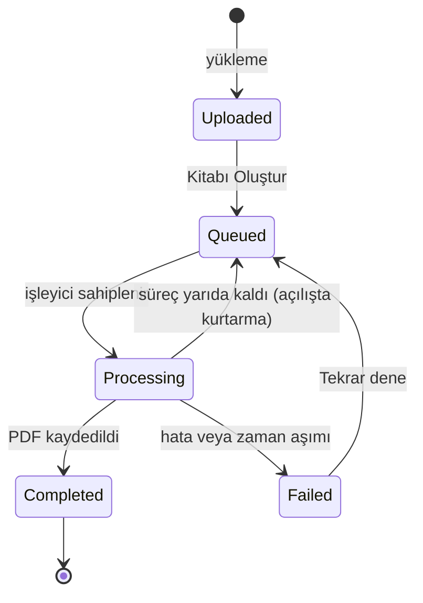

Başarısız üretimde kayıt `Durum = 'Failed'` olur; `HataKodu` ve `HataMesaji` doldurulur (veritabanı kısıtı mesajsız başarısızlığa izin vermez). Başarısız kitabın sırası düzenlenip üretim yeniden başlatılabilir.

<a id="dosya-saklama"></a>

## Dosya saklama yaklaşımı

- Dosyalar `IFileStorage` arayüzü arkasındaki `LocalFileStorage` ile yerel diskte saklanır. Kök klasör `Storage:RootPath` ayarıdır: yerelde `App_Data/storage` (API'nin içerik kökünün altında), Docker'da `storage` volume'una bağlı `/data/storage`.
- `wwwroot` kullanılmaz: kaynak .docx dosyaları temizlenmemiş iletişim bilgisi içerir ve statik dosya olarak herkese açık servis edilmemelidir. PDF yalnızca API ucu üzerinden, kitap `Completed` olduğunda verilir. Orijinal .docx'i indiren bir uç yoktur.
- Anahtarlar sistem tarafından üretilir: `books/{kitapId}/sources/{bildiriId}.docx` ve `books/{kitapId}/output/book.pdf`. Kullanıcının dosya adı hiçbir zaman yol olarak kullanılmaz; yalnızca `OrijinalDosyaAdi` kolonunda gösterim için tutulur.
- Yazım atomiktir: içerik aynı klasörde geçici bir dosyaya yazılır, sonra hedefin yerine taşınır. Yarım kalan yazım önceki dosyayı bozmaz.
- Yol aşımı (path traversal) savunması: her anahtar kök klasöre göre çözülür ve kökün dışına çıkan anahtar reddedilir.
- Kitap silindiğinde veritabanı kayıtlarıyla birlikte `books/{kitapId}/` klasörü de silinir.

<a id="word-pdf"></a>

## Word → PDF işleme

### Okunan öğeler

`OpenXmlDocxReader`, belge gövdesini sırayla dolaşır ve kütüphaneden bağımsız bir belge modeli üretir: paragraflar (hizalama, önce/sonra boşluk, satır aralığı, girintiler, `keepNext`), run'lar (kalın, italik, altı çizili, punto, serif/sans, üst/alt simge, köprü), sekme ve satır sonları, açık sayfa sonları (`w:br w:type="page"` ve `w:pageBreakBefore`), basit tablolar (yatay hücre birleştirme dahil), dipnotlar (bildirinin sonunda numaralı), metin kutuları, içerik denetimleri (`w:sdt`) ve izlenen değişikliklerde eklenen metin. Silinen metin (`w:del`) ve gizli metin (`w:vanish`) atlanır. Tanınmayan öğeler üretimi durdurmaz.

### Stil çözümleme

Biçim katman katman hesaplanır: belge varsayılanları → paragraf stili (`basedOn` zinciriyle) → karakter stili → doğrudan run biçimi. İki ayrıntı önemlidir:

- Başlık stili stil kimliğiyle değil, çözümlenen stil adıyla tanınır. Örnek bildirilerde stil kimliği yerelleştirilmiştir (`KonuBal`), adı ise `Title`'dır.
- `b` ve `i` gibi aç/kapa özellikleri değerleriyle okunur. Örnek bildirilerde kalın olmayan run'larda `<w:b w:val="0"/>` bulunur; yalnızca öğenin varlığına bakmak her şeyi kalın yapardı.

### Başlık tespiti

Sırasıyla: (1) çözümlenen stil adı `Title` veya `heading 1` olan ilk boş olmayan paragraf; (2) ilk beş paragraf içinde ortalı ve tamamı kalın ilk paragraf; (3) dosya adı (uzantı ve baştaki `01_` gibi sıra öneki atılır, `_` boşluğa çevrilir). Başlık metni olduğu gibi kullanılır; büyük/küçük harf dönüştürmesi yapılmaz. Kaynağı kaydedilir ve arayüzde gösterilir. Belge özelliklerindeki (`docProps/core.xml`) başlık kullanılmaz: örnek dosyalarda küçük harfe çevrilmiş ve bozuk karakterler içerir.

### Kitap düzeni ve sayfa numaraları

- A4 sayfa, 2,5 cm kenar boşluğu; gövde yazı tipi kaynaktaki puntoyla Liberation Serif, serif olmayan yazı tipleri Liberation Sans'a eşlenir. Heceleme kapalıdır.
- Sayfa 1 kapaktır (kitap adı, "Bildiri Kitabı", bildiri sayısı, `tr-TR` biçiminde oluşturulma tarihi); numarası basılmaz.
- İçindekiler 2. sayfadan başlar, gerekirse birden çok sayfaya taşar. Her satırda solda sıra numarası, ortada başlık, sağda başlığın satırlarının dikey ortasına hizalı başlangıç sayfası bulunur (tek satırlık başlıkta o satırla aynı hizada; sıra numarası ilk satırla hizalıdır); girdiler arasında ince açık gri bir çizgi vardır. Satır tıklanabilir bir iç bağlantıdır.
- Her bildiri yeni sayfada başlar ve QuestPDF'te adlandırılmış bir bölüm (section) olarak dizilir. İçindekiler'deki numara, dizgi motorunun o bölümün ilk sayfası için verdiği numaradır (`BeginPageNumberOfSection`); elle hesap veya tahmin yoktur, bu yüzden İçindekiler'in kendisi uzasa bile numaralar doğru kalır.
- Basılı sayfa numarası fiziksel sayfa sırasıdır (kapak 1 sayılır). Böylece İçindekiler'deki numara PDF görüntüleyicinin sayfa kutusundaki numarayla aynıdır; "sayfa 11" yazan başlık görüntüleyicide 11. sayfadadır. Roma rakamlı ön sayfalar bu eşleşmeyi bozacağı için seçilmedi.
- İçerik sayfalarının üst bilgisi basılı kitaplardaki gibidir: çift numaralı (sol) sayfalarda sola hizalı kitap adı, tek numaralı (sağ) sayfalarda sağa hizalı bildiri başlığı. Metin hiçbir zaman kesilmez ve üç nokta kullanılmaz: tek satıra sığana kadar 9 → 8,5 → 8 → 7,5 → 7 pt küçültülür, 7 pt'de de sığmazsa iki satıra kırılır. Genişlik QuestPDF'in kendi ölçümüyle (gömülü yazı tiplerinin gerçek glif genişlikleri, yedek yazı tipleri dahil) bulunur. Alt bilgide ortada sayfa numarası vardır.
- İçindekiler'de sayfa numarasının dikey merkezi, girdinin başlık satırlarının dikey merkeziyle aynıdır (testte en fazla 1 pt fark). Numara başlıktan sonra çizildiği için PDF'ten metin kopyalanırken veya aranırken her girdide önce başlık, sonra sayfa numarası gelir (pdf.js gibi çizim sırasını izleyen okuyucularda; testte de bu sırayla okunur).
- PDF üst verisi (başlık, oluşturan) uygulama tarafından yazılır; kaynak belgelerin üst verisi (başlık, yazar, son değiştiren) PDF'e taşınmaz.

### Yazı tipleri ve desteklenmeyen karakterler

Yazı tipleri uygulamaya gömülüdür, sistem yazı tipleri kullanılmaz; bu yüzden çıktı Windows'ta ve Linux konteynerinde aynıdır. Zincir: Liberation Serif/Sans (Times New Roman ve Arial ile metrik uyumlu, Türkçe karakterler tam) → eksik karakterler için DejaVu Serif/Sans (ör. `≤`, `≥`, `±`, `µ`, Yunan harfleri). Hiçbir yazı tipinde bulunmayan bir karakter sessizce boş kutu olarak basılmaz: yükleme sırasında ilgili dosya (`FILE_UNSUPPORTED_CHARACTER`) veya kitap adı (`BOOK_NAME_UNSUPPORTED_CHARACTER`) karakter ve konumuyla reddedilir. Denetim, yazı tiplerinin `cmap` tablolarından okunan karakter kapsamıyla yapılır.

<a id="iletisim-temizligi"></a>

## İletişim bilgisi temizliği

### Yaklaşım

`ContactInfoSanitizer` (Core) her paragrafta çalışır ve yalnızca e-posta ve telefon **değerlerini** ve bu değerlere bağlı **etiketleri ve ayırıcıları** siler; paragrafın geri kalanına ve biçimine (kalın, italik) dokunmaz.

- Run metinleri birleştirilerek aranır; iki run'a bölünmüş bir e-posta da bulunur ve silme her run'a ayrı uygulanır.
- **E-posta:** standart adresler (Unicode harfler, `+`, alt alan adları, büyük harf) ve gizlenmiş biçimler (`ad [at] alan.edu.tr`, `ad(at)alan.edu.tr`, `ad [at] alan [dot] edu [dot] tr`). `mailto:` ve `tel:` köprülerinin hedefi de düşürülür.
- **Telefon:** rakamlar ve `boşluk . - ( )` ayırıcılarından oluşan, `+` ile başlayabilen adaylar; iki yanında başka rakam grubu olmamalıdır. Aday rakamlara indirgenir ve doğrulanır: Türkiye numarası için baştaki `+90`, `90` veya `0` atıldıktan sonra tam 10 hane ve ilk hane 2, 3, 4, 5 veya 8 (sabit hat, mobil, 850); uluslararası numara için `+` ile başlayan 8–15 hane.
- **İstisnalar:** `ORCID`, `ISBN`, `ISSN`, `DOI` etiketinden sonra gelen diziler, 16 haneli dörtlü gruplar, tarihler (`25.09.2026`), yıl aralıkları (`2019-2023`), ondalık ve binlik ayraçlı sayılar, IBAN parçaları korunur.
- **Etiket ve ayırıcı temizliği:** silinen değerin hemen yanındaki etiketler (`E-posta`, `Email`, `Mail`, `Tel`, `Tel.No`, `Telefon`, `GSM`, `Cep`, `Cep telefonu`, `Mobile`, `Phone`, `Faks`, `İrtibat`, `İletişim`, `Contact` vb.; büyük/küçük harf duyarsız, `tr-TR` kültürüyle) ve artık ayırıcılar (`|`, `/`, `;`, `,`, ` - `, `–`, `—`) silinir, çift boşluklar tekleştirilir. Silinen bölgeden uzak ayırıcılara (ör. bir DOI içindeki `/`) dokunulmaz.
- Temizlik sonunda tamamen boşalan paragraf kaldırılır; kaynakta zaten boş olan paragraflar (ör. sayfa sonu paragrafı) korunur.

Etiket ve ayırıcıların da silinmesi bu projenin yorumudur. Yalnızca değer silinseydi PDF'te `E-posta:  | Tel:  | ORCID: …` gibi anlamsız kalıntılar ya da yalnızca "Cep:" yazan satırlar kalırdı. Kural "iletişim bilgisi görünmemeli, diğer bilgiler aynen korunmalı" olduğundan, değere ait olan etiket de iletişim bilgisinin parçası sayıldı; iletişimle ilgisi olmayan her şey (ORCID, kurum adı, metin) aynen kalır.

### Test verisinde önce ve sonra

Aşağıdaki değerler örnek bildirilerdeki kurgusal verilerdir (`example.org` adresleri ve `0500 000 …` numaraları).

| Bildiri | Kaynaktaki satır | PDF'teki sonuç |
|---|---|---|
| 01 | `E-posta: elif.kaya@example.org \| Tel: 0500 000 00 01 \| ORCID: 0000-0001-1000-0001` | `ORCID: 0000-0001-1000-0001` |
| 02 (1) | `Email: mert.demir@example.org \| Telefon: +90 (500) 000 00 02 \| ORCID: 0000-0001-1000-0002` | `ORCID: 0000-0001-1000-0002` |
| 02 (2) | `E-posta derya.akin@example.org / GSM 0 (500) 000 00 12` | *(paragraf kaldırılır)* |
| 03 | `İletişim: selin.arslan@example.org - 0500-000-00-03 - ORCID 0000-0001-1000-0003` | `ORCID 0000-0001-1000-0003` |
| 04 (1) | `kerem.celik@example.org \| Cep: +90 500 000 00 04` | *(paragraf kaldırılır)* |
| 04 (2) | `zeynep.sen@example.org \| 0500 000 10 04` | *(paragraf kaldırılır)* |
| 05 | `Eposta: burcu.ozturk@example.org; Telefon: (0500) 000 00 05` | *(paragraf kaldırılır)* |
| 06 | `E-mail onur.sahin@example.org \| Mobile +90-500-000-00-06` | *(paragraf kaldırılır)* |
| 07 (1) | `nazli.er@example.org / Tel.No: 0 500 000 00 07` | *(paragraf kaldırılır)* |
| 07 (2) | `emre.topal@example.org / GSM: +90 (500) 000-10-07` | *(paragraf kaldırılır)* |
| 08 | `Mail: ipek.yalcin@example.org \| İrtibat: 0500.000.00.08` | *(paragraf kaldırılır)* |
| 09 | `tolga.gunes@example.org \| Telefon 0500 000 00 09` | *(paragraf kaldırılır)* |
| 10 | `E-posta: asli.cetin@example.org \| Cep telefonu: +90 500 000 00 10` | *(paragraf kaldırılır)* |

Toplam 13 e-posta ve 13 telefon silinir, 3 ORCID korunur; bu sayılar kitap sayfasında bildiri bazında gösterilir.

### Kitap adındaki iletişim bilgisi

Kitap adı kullanıcının kendi girdisidir ve kapakta, üst bilgide ve PDF üst verisinde aynen kullanılır; içinde bir e-posta veya telefon olsa bile reddedilmez ve değiştirilmez. Temizlik kuralı Word içeriği içindir. Sızıntı taraması bu değerleri (telefon rakamlarına, e-posta küçük harfe indirgenerek) izinli sayar; bildirilerden gelen başka bir değer yine sızıntıdır.

### Üretim sonrası sızıntı taraması

Temizliğe ek bir güvence olarak, üretilen PDF'in metni PdfPig ile çıkarılır ve aynı e-posta ve telefon desenleriyle taranır. Eşleşme varsa PDF yayımlanmaz ve kitap `Failed` (`CONTACT_LEAK_DETECTED`) olur. Kaynak belgelerin üst verisinin (ör. `lastModifiedBy` alanındaki numara) PDF'e taşınmadığı ayrıca test edilir.

### Örnek testler

Test dosyaları: [`ContactInfoSanitizerTests.cs`](backend/tests/BildiriKitabi.UnitTests/Sanitization/ContactInfoSanitizerTests.cs), [`BookEndToEndTests.cs`](backend/tests/BildiriKitabi.IntegrationTests/Books/BookEndToEndTests.cs), [`RendererAndLeakScannerTests.cs`](backend/tests/BildiriKitabi.IntegrationTests/Pdf/RendererAndLeakScannerTests.cs), [`BookNameContactTests.cs`](backend/tests/BildiriKitabi.IntegrationTests/Pdf/BookNameContactTests.cs).

- `Sample_contact_lines_are_cleaned_exactly` — yukarıdaki 13 satır gerçek .docx dosyalarından okunur ve beklenen sonuçla birebir karşılaştırılır.
- `All_sample_papers_lose_thirteen_emails_and_thirteen_phones_and_keep_three_orcids`
- `Phone_numbers_are_removed` — `0312 555 12 34`, `+90 312 555 12 34`, `0850 222 00 00`, `+44 20 7946 0958`, `+1 (202) 555-0147` vb.
- `Email_addresses_are_removed` — `ad.soyad+kongre@mail.univ.edu.tr`, büyük harfli, Türkçe karakterli ve gizlenmiş biçimler.
- `Non_contact_numbers_are_kept_verbatim` — ORCID, ISBN, DOI, yıl aralığı, tarih, yüzde, binlik ayraçlı tutar, `p<0.05`, IBAN.
- `Email_split_across_runs_is_removed_and_neighbouring_formatting_is_kept`
- `Book_contains_no_email_addresses_or_turkish_phone_numbers` — örnek kitabın PDF metni üzerinde.
- `Generation_fails_with_contact_leak_code_when_the_rendered_pdf_still_contains_contact_values`

<a id="kuyruk"></a>

## Kuyruk ve arka plan işleme

Kuyruk `IBookGenerationQueue` arayüzünün arkasındadır; mesaj yalnızca kitap kimliğini (ve mesaj sürümünü) taşır. Durumun tek doğru kaynağı veritabanıdır.

- **Yayın:** "Kitabı Oluştur" kitabı `Queued` yapıp kaydeder, sonra mesajı yayımlar. RabbitMQ sağlayıcısı kalıcı (persistent) JSON mesajı dayanıklı `bildiri-kitabi.uretim` kuyruğuna publisher confirms ile gönderir; çağrı ancak broker onayladıktan sonra döner.
- **Tüketim:** API sürecindeki `BookGenerationWorker`, en fazla `Generation:MaxConcurrency` (varsayılan 2) işi aynı anda, her birini kendi DI kapsamında çalıştırır; RabbitMQ'da prefetch bu sayıya eşittir. İş başına zaman sınırı `Generation:TimeoutSeconds` (varsayılan 120 sn) aşılırsa kitap `GENERATION_TIMEOUT` koduyla `Failed` olur.
- **Onay (ack):** mesaj, işleyici döndükten sonra onaylanır (en az bir kez teslim). İşleyici idempotenttir: yalnızca hâlâ `Queued` olan kitap, tek bir işleyicinin kazanabileceği koşullu bir güncellemeyle sahiplenilir; ikinci kez teslim edilen mesaj zararsızdır.
- **DLQ:** işleyici beklenmedik bir istisna atarsa veya mesaj gövdesi geçersizse mesaj `bildiri-kitabi.uretim.dlq` ölü mektup kuyruğuna gider. Beklenen üretim hataları (bozuk belge, sızıntı, zaman aşımı) kitabı `Failed` yapar ve mesaj normal şekilde onaylanır.
- **Kesinti ve kurtarma:** uygulama bir işin ortasında durursa onaylanmamış mesaj yeniden teslim edilir; açılışta `Processing` kalmış kitaplar `Queued` durumuna döner ve bekleyen kitaplar yeniden kuyruğa eklenir. `QueuedBookSweeper`, `Generation:RequeueStaleAfterSeconds` süresinden uzun `Queued` bekleyen kitapları (ör. broker kapalıyken istenmiş olanları) yeniden kuyruğa ekler; veritabanı satırı basit bir outbox gibi çalışır.
- **Süreç içi sağlayıcı:** Docker'sız yerel geliştirmede varsayılan olan `InMemory` sağlayıcısı sınırlı bir `Channel` kullanır; mesajlar süreçle birlikte kaybolur ama açılış kurtarması ve süpürücü bekleyen her kitabı yeniden kuyruğa ekler.
- **Sağlık:** `/health`, RabbitMQ sağlayıcısı seçildiğinde bağlantı kontrolünü de içerir.

MassTransit yerine doğrudan `RabbitMQ.Client` kullanıldı: tek kuyruk ve tek mesaj türü için gereken topoloji (kalıcı kuyruk, DLX/DLQ, publisher confirms, elle onay) birkaç yüz satırdır ve her adımı görünür kalır. MassTransit'in güncel ana sürümü ticari lisansa geçmiştir; ek bir soyutlama katmanı ve lisans yükü bu kapsam için gerekçelendirilemedi.

<a id="arayuz"></a>

## Arayüz ve tasarım kararları

- **Adım yapısı:** "Yeni kitap" üç adımlı bir akıştır — (1) kitap adı ve dosyalar, (2) sıra ve kontrol, (3) oluşturma ve görüntüleme. Adımlar üstte bir adım göstergesiyle izlenir; tarayıcı adresi kitaba bağlıdır, sayfa yenilense de akış kaldığı yerden devam eder.
- **Dosya listesi:** masaüstünde başlık ve satırların aynı sütun düzenini paylaştığı bir tablo (sıra, dosya adı, boyut, durum), telefonda aynı bilgileri taşıyan kartlar. Bu tabloda ve Kitaplarım'da kısa, biçimi sabit sayılar (boyut, bildiri ve sayfa sayısı) başlıklarıyla birlikte ortalıdır ve eşit genişlikli rakamlarla yazılır; durum etiketleri, genişlikleri farklı olduğu için sola hizalıdır; komşu sütunların içerikleri arasında en az yaklaşık 2rem boşluk kalır. Dosyalar yükleme alanına sürükleyip bırakarak veya dosya seçiciyle eklenir; eksik, fazla, yanlış türde veya mükerrer dosya hemen, dosya bazında belirtilir. "Ada göre sırala" doğal sayı sıralaması kullanır (`2_…` önce, `10_…` sonra); liste zaten sıralıysa pasiftir ve nedeni bir ipucu balonunda görünür (fareyle üzerine gelince açılır, imleç ayrılınca kapanır; klavye odağında açılır, Esc ile kapanır; telefonda dokununca birkaç saniye görünür), sıralayınca kısa bir onay gösterir.
- **Yükleme:** önce yükleme yüzdesi, dosyalar gönderildikten sonra "Dosyalar kontrol ediliyor ve başlıklar tespit ediliyor…" aşaması gösterilir. Her sayfa geçişinde sayfa en üstten başlar ve odak yeni sayfanın başlığına taşınır (geri/ileri tuşlarında tarayıcının konumu korunur).
- **Sıralama:** ikinci adımda tespit edilen başlıklar ve başlık kaynağı görünür. Sıra yalnızca her satırdaki Yukarı / Aşağı düğmeleriyle değişir (sürükle-bırak sıralama kaldırıldı); ilk satırda Yukarı, son satırda Aşağı pasiftir. Taşımadan sonra odak aynı bildirinin düğmesinde kalır ve yeni sıra ekran okuyucuya duyurulur; sıra yükleme sırasından farklıysa bir not gösterilir.
- **Bekleme ekranı:** sunucudaki gerçek aşamalar (okuma, temizlik, düzenleme, PDF oluşturma, kontrol, kaydetme) ve gerçek yüzde gösterilir; yapay gecikme veya sahte ilerleme yoktur. Durum kısa aralıklarla yoklanır, sekme arka plandayken yoklama durur.
- **Sonuç ve hata:** tamamlanınca başlığın altındaki tek satır durumu özetler (`10 bildiri · 22 sayfa · tarih · Hazır`) ve görüntüleyici açılır. Temizlenen e-posta ve telefon sayıları, satırın sonundaki bilgi düğmesinin açtığı küçük panelde toplam ve bildiri bazında gösterilir. Hata durumunda sunucunun Türkçe mesajı, "Tekrar dene" ve "Sırayı düzenle" seçenekleri gösterilir.
- **Kitaplarım:** her satırda doğrudan bir "Sil" düğmesi (telefonda yalnızca simge) ve onay diyaloğu vardır; kitap kuyrukta veya hazırlanırken düğme pasiftir ve nedeni ipucunda yazar.
- **Etkileşim:** tıklanabilir her öğede el imleci, pasif öğelerde "izin yok" imleci; tüm düğmelerde belirgin hover ve basılı durumları (130 ms, azaltılmış harekette geçiş yok); "Kaldır" ve "Sil" gibi yıkıcı eylemler normalde nötr, üzerine gelindiğinde veya klavye odağında kırmızıdır. Kaydırma çubukları ince ve uygulamanın renklerindedir.
- **Görüntüleyici:** hazır kitapta ekranın tam genişliğini (en fazla yaklaşık 1800 px) ve pencere yüksekliğini kullanır. Varsayılan açılış çift sayfa ve genişliğe sığdırmadır; 1920 × 1080 bir ekranda gövde metni yaklaşık 13 px'tir. Sığdırma modlarında yatay kaydırma olmaz; "Sayfaya sığdır" sayfaları tamamen gösterir. Kapak ve tek kalan son sayfa ortada durur, karşılıklı sayfalar ortada birleşir. Yakınlaştırma yüzdesi gerçek boyuta göredir (%100 = A4'ün 96 dpi'deki boyutu) ve %25–%400 arasındadır. Araç çubuğundaki yüzde kutusuna "150", "%150" veya "150%" yazılabilir: tıklayınca değer seçilir, Enter'la veya kutudan çıkınca uygulanır, Esc iptal eder, ↑ / ↓ 10'ar puan değiştirir; aralık dışı değer sınıra çekilir, sayı olmayan değer yok sayılır. Elle girilen yüzde sığdırma modunu kapatır; + / − düğmeleri aynı sınırları kullanır. Yakınlaştırınca görünen bölgenin ortası yerinde kalır, sayfa değişmez. Sol panelde (daraltılabilir, 330 px) İçindekiler ve vurgulu olarak bulunulan bildiri; araç çubuğunda sayfa gezinme, yakınlaştırma, tek/çift sayfa, tam ekran ve indirme bulunur. Geçerli sayfa adres çubuğunda (`?sayfa=`) tutulur. Sayfalar ekran yoğunluğuna ve yakınlaştırmaya göre (üst sınırlı) net çizilir.
- **Mobil:** görüntüleyici tek sayfa ve genişliğe sığdırılmış açılır. A4 sayfa telefonda küçük kaldığı için alttaki sabit araç çubuğunda yakınlaştır / uzaklaştır düğmeleri vardır; çift dokunma, dokunulan noktayı ortada tutarak genişliğe sığdır ile %200 arasında geçiş yapar. Yakınlaştırılmış sayfa iki eksende kaydırılır; tarayıcının kendi sıkıştırarak yakınlaştırması da açıktır. İçindekiler alttan açılan bir panelde gösterilir.
- **Erişilebilirlik:** tüm akış klavyeyle kullanılabilir; aşama değişiklikleri ve sıra değişiklikleri ekran okuyuculara duyurulur; renk çiftlerinin kontrast oranları birim testle (metin 4.5:1, arayüz öğeleri 3:1) doğrulanır; dokunma hedefleri en az 44 px'tir; her ekran E2E testlerinde axe ile taranır.

| Ekran | Masaüstü | Mobil |
|---|---|---|
| Adım 1: ad ve dosyalar | 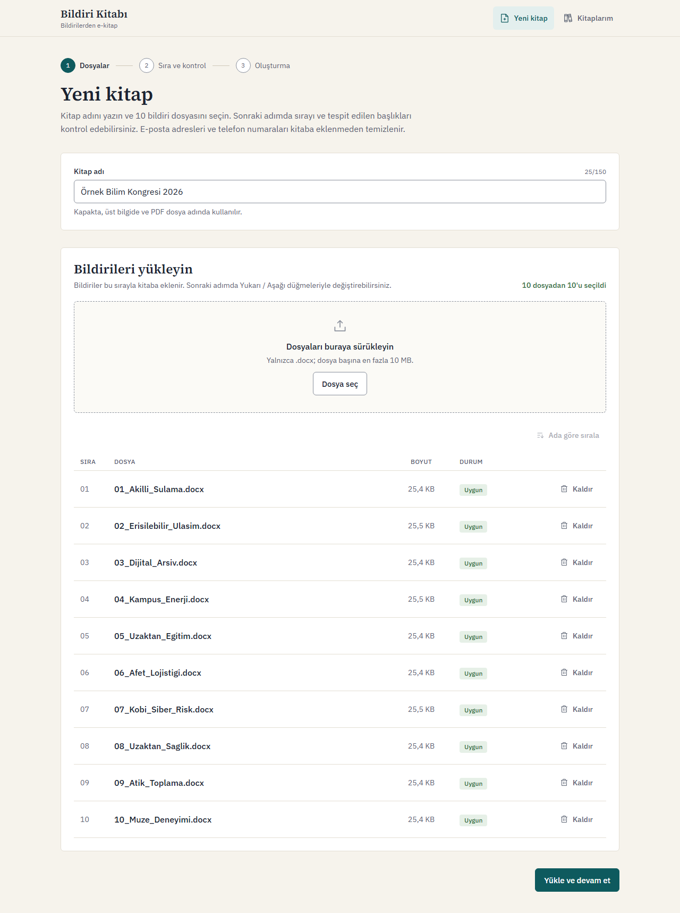 | 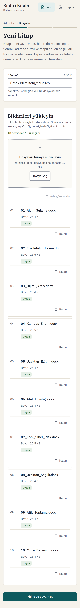 |
| Adım 2: sıra ve kontrol | 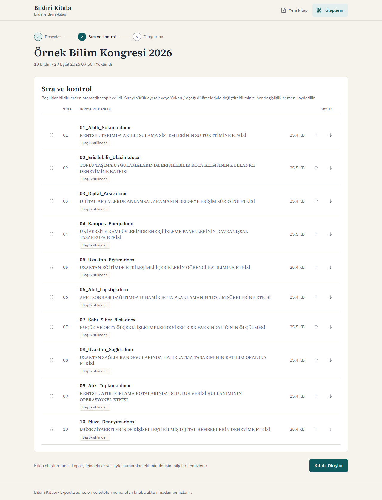 | 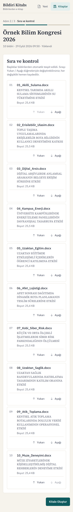 |
| Üretim | 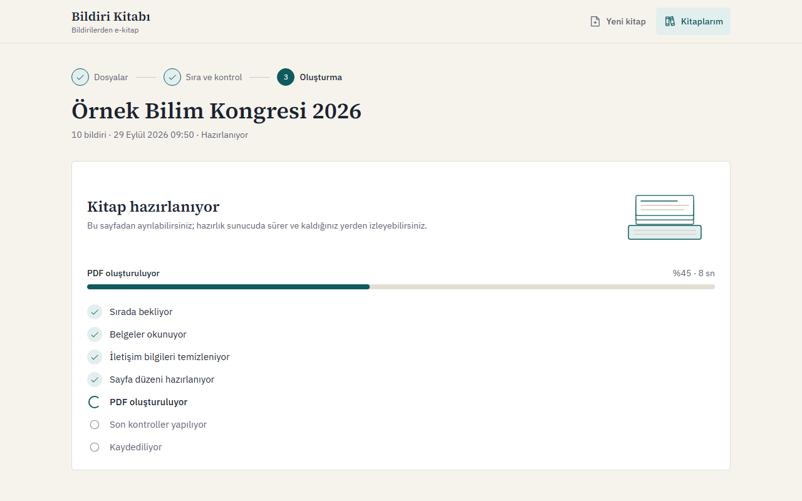 | |
| Hata | 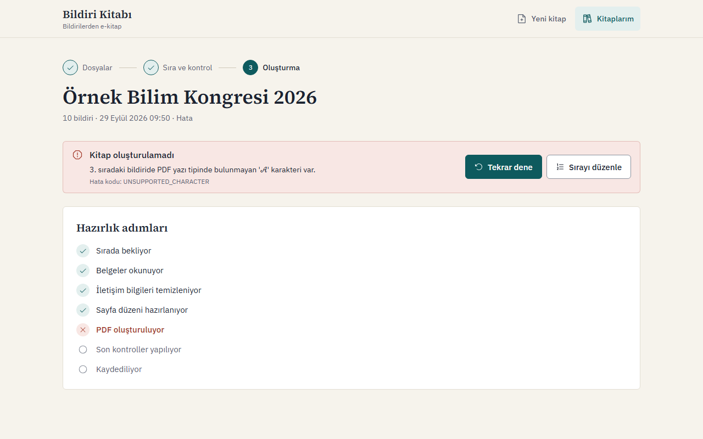 | |
| Görüntüleyici |  | 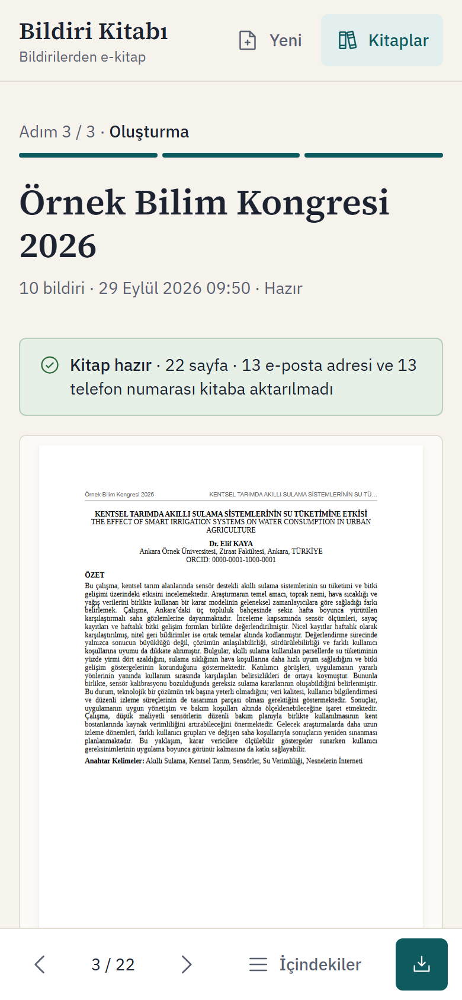 |
| Görüntüleyici: 1920 px varsayılan açılış / mobilde %200 | 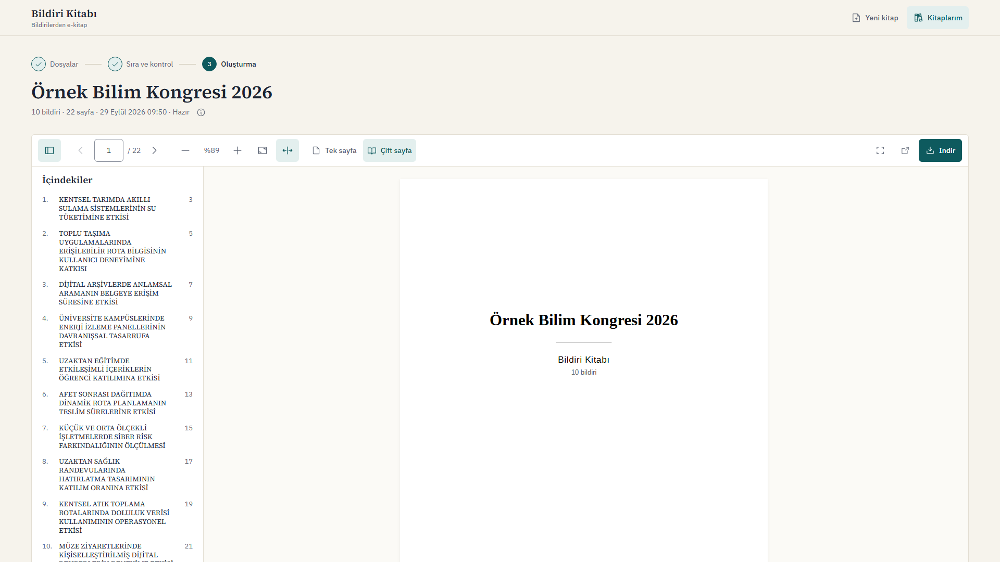 | 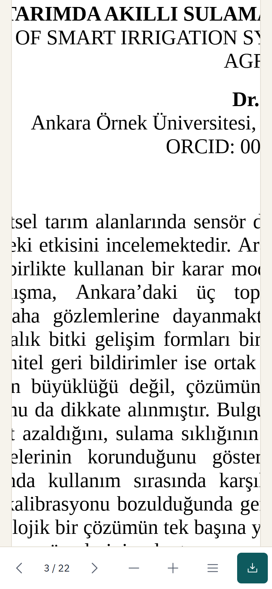 |

<a id="api"></a>

## API

| Metot | Yol | Açıklama | Başlıca yanıtlar |
|---|---|---|---|
| `POST` | `/api/books` | `multipart/form-data`: `name` ve tam 10 `files`. Doğrular, başlıkları tespit eder, kaydeder. | `201` kitap ayrıntısı; `400` dosya bazında hatalar; `413`; `429` |
| `GET` | `/api/books` | Kitapların listesi, en yeni önce; sayfalı. | `200` |
| `GET` | `/api/books/{id}` | Durum, aşama, yüzde, bildiriler, başlıklar, sayfa aralıkları, silinen sayılar, hata. | `200`; `404` |
| `PUT` | `/api/books/{id}/paper-order` | Bildiri sırasını değiştirir (yalnızca `Uploaded` veya `Failed`). | `200`; `400`; `404`; `409` |
| `POST` | `/api/books/{id}/generate` | Üretimi kuyruğa alır (yalnızca `Uploaded` veya `Failed`); çift istekte biri kazanır. | `202`; `404`; `409`; `429` |
| `GET` | `/api/books/{id}/pdf` | Üretilen PDF; aralık istekleri (`206`), `ETag`/`304`. `?download=true` indirme olarak verir (`Content-Disposition`, ASCII ve RFC 5987 `filename*`). | `200`/`206`/`304`; `404`; `409` |
| `DELETE` | `/api/books/{id}` | Kitabı, bildirilerini ve dosyalarını siler (kuyrukta veya işlenirken değil). | `204`; `404`; `409` |
| `GET` | `/health` | Veritabanı ve (seçiliyse) RabbitMQ sağlık raporu, JSON. | `200`; `503` |

Hata biçimi: tüm hatalar `application/problem+json` (RFC 9457) olarak döner. `detail` kullanıcıya gösterilebilecek Türkçe mesajdır, `code` makine okunur koddur (ör. `PAPER_COUNT_INVALID`, `FILE_DUPLICATE`, `GENERATION_ALREADY_IN_PROGRESS`, `BOOK_NOT_COMPLETED`). Yükleme hataları ayrıca dosya bazında bir `errors` listesi taşır. İstemciye yığın izi (stack trace) verilmez.

Rate limiting: istemci IP'si başına dakikalık sabit pencere; yükleme için 10, üretim için 20 istek (`RateLimiting:*` ayarları). Aşıldığında `429` ve `RATE_LIMITED` kodu döner. Docker kurulumunda istemci IP'si nginx'in `X-Forwarded-For` başlığından, yalnızca kurulumun kendi ağından gelen isteklerde okunur.

Development ortamında OpenAPI belgesi `/openapi/v1.json`, etkileşimli referans `/scalar` adresindedir; Production'da (Docker) kapalıdır.

<a id="testler"></a>

## Testler

| Komut | Kapsam | Sayı |
|---|---|---|
| `cd backend && dotnet test` | Birim testleri (`BildiriKitabi.UnitTests`): okuma, stil çözümleme, temizlik, başlık, doğrulama, durum geçişleri, depolama, kuyruk yapılandırması, açılış migration'ının yeniden deneme kuralları (sahte saatle). Entegrasyon testleri (`BildiriKitabi.IntegrationTests`): örnek bildirilerle uçtan uca PDF, dizgi ve sızıntı tarayıcısı, yazı tipi yedekleri, migration ve kısıtlar, gerçek SQL Server hatalarının geçici/kalıcı ayrımı, API uçları ve yaşam döngüsü, RabbitMQ topolojisi, onay, DLQ, yeniden teslim ve broker kesintisi. | 402 |
| `cd frontend && npm run test` | Bileşen ve birim testleri (Vitest, Testing Library, MSW): sayfalar, dosya seçimi, hata eşleme, görüntüleyici, sayfa hesapları, kontrast. | 250 |
| `cd frontend && npm run test:e2e` | Playwright, masaüstü ve mobil: gerçek API (kendi veritabanıyla, Release derlemesi) ve Vite geliştirme sunucusu otomatik başlatılır; mutlu yol, doğrulama, hata ve bekleme ekranları, liste ve silme, görüntüleyici (1920 px varsayılan açılış, yakınlaştırma ve yazılan yüzde, mobilde çift dokunma), düzen, axe ile erişilebilirlik taraması. | 16 |
| `cd frontend && npm run test:e2e:docker` | Aynı E2E testleri çalışan Docker kurulumuna karşı (varsayılan http://localhost:8080, `E2E_BASE_URL` ile değiştirilebilir); ayrıca nginx'in CSP'si altında CSP ihlali olmadığını doğrular. | 16 |

Diğer kontroller: `npm run lint`, `npm run typecheck`, `npm run build`. İlk E2E çalıştırmasından önce tarayıcı bir kez kurulmalıdır: `npx playwright install chromium`.

Docker gerektirenler:

- Entegrasyon testlerinin SQL Server ve RabbitMQ kullananları Testcontainers ile geçici konteynerler başlatır; Docker yoksa bu testler nedeni yazılarak atlanır (skip).
- `npm run test:e2e` yerelde SQL Server bekler: varsayılan olarak LocalDB (`BildiriKitabi_E2E` veritabanı, her koşuda sıfırlanır); başka bir sunucu `E2E_CONNECTION_STRING` ortam değişkeniyle verilir.
- `npm run test:e2e:docker` için Docker kurulumu çalışır durumda ve rate limit değerleri yükseltilmiş olmalıdır ([Hızlı başlangıç](#hizli-baslangic) notlarına bakın).

<a id="kutuphaneler"></a>

## Kullanılan kütüphaneler ve lisanslar

### Backend

| Kütüphane | Amaç | Lisans |
|---|---|---|
| ASP.NET Core, EF Core 10 (`Microsoft.EntityFrameworkCore.SqlServer`) | Web API, veri erişimi, migration | MIT |
| DocumentFormat.OpenXml | .docx okuma | MIT |
| QuestPDF | PDF dizgisi | QuestPDF Community License |
| UglyToad.PdfPig | Üretilen PDF'ten metin çıkarma (sızıntı taraması, testler) | Apache-2.0 |
| RabbitMQ.Client | RabbitMQ kuyruk sağlayıcısı | Apache-2.0 / MPL-2.0 |
| Scalar.AspNetCore | Development ortamında API referansı | MIT |
| xUnit v3, Shouldly | Test çatısı ve doğrulamalar | Apache-2.0, BSD-3-Clause |
| Testcontainers (MsSql, RabbitMq) | Testlerde geçici SQL Server ve RabbitMQ | MIT |

### Frontend

| Kütüphane | Amaç | Lisans |
|---|---|---|
| React 19, React Router | Arayüz ve yönlendirme | MIT |
| Vite, TypeScript | Derleme, tip denetimi | MIT, Apache-2.0 |
| Tailwind CSS v4 | Stil | MIT |
| TanStack Query, openapi-fetch, openapi-typescript | Sunucu durumu, OpenAPI şemasından tipli istemci | MIT |
| react-pdf, pdfjs-dist | PDF görüntüleyici | MIT, Apache-2.0 |
| Phosphor Icons | Simgeler | MIT |
| Vitest, Testing Library, MSW, jsdom | Birim ve bileşen testleri | MIT |
| Playwright, axe-core | E2E ve erişilebilirlik taraması | Apache-2.0, MPL-2.0 |
| ESLint, typescript-eslint, eslint-plugin-jsx-a11y, Prettier | Kod denetimi ve biçimlendirme | MIT |

### Yazı tipleri

| Yazı tipi | Kullanım | Lisans |
|---|---|---|
| Liberation Serif, Liberation Sans | PDF gövdesi ve başlıkları (gömülü) | SIL OFL 1.1 ([`OFL.txt`](backend/src/BildiriKitabi.Infrastructure/Fonts/OFL.txt)) |
| DejaVu Serif, DejaVu Sans | PDF'te eksik karakterler için yedek | Bitstream Vera / Arev yazı tipi lisansı, serbest ([`DejaVu-LICENSE.txt`](backend/src/BildiriKitabi.Infrastructure/Fonts/DejaVu-LICENSE.txt)) |
| Source Serif 4 | Arayüz başlıkları | SIL OFL 1.1 |
| IBM Plex Sans | Arayüz metni | SIL OFL 1.1 |

### Konteyner imajları

SQL Server 2022 (Developer sürümü; Microsoft lisansı, üretim dışı kullanım içindir), RabbitMQ 4 (MPL-2.0), nginx-unprivileged (BSD-2-Clause), .NET ASP.NET çalışma imajı (MIT).

### Notlar

- **QuestPDF lisansı:** Community lisansı yıllık brüt geliri 1 milyon USD'nin altındaki kuruluşlar, bireyler ve açık kaynak projeler için ücretsizdir; bu eşiğin üstündeki bir kuruluşta kullanım için Professional veya Enterprise lisans gerekir. Lisans gerektirmeyen bir alternatif PDFsharp/MigraDoc'tur (MIT); dizgi `QuestPdfBookRenderer` sınıfında toplandığından değiştirilebilir, ancak İçindekiler sayfa numaraları için bölüm numarası özelliğinin karşılığı yazılmalıdır.
- **ESLint 9:** ESLint 10 yayımlanmış olsa da erişilebilirlik kurallarını sağlayan `eslint-plugin-jsx-a11y` henüz ESLint 10'u desteklemediği için 9.x sürümünde kalındı.
- **FluentAssertions** 8. sürümle ticari lisansa geçtiği için kullanılmadı; yerine Shouldly tercih edildi.

<a id="guvenlik"></a>

## Güvenlik notları

- **Dosya doğrulaması:** uzantı `.docx` olmalı; içerik ZIP imzası taşımalı, OpenXML ile açılabilmeli ve ana parça türü Word belgesi olmalı (`.docm`, `.dotx` ve uzantısı değiştirilmiş PDF/ZIP reddedilir). Dosya başına 10 MB, toplam 60 MB sınırı uygulamada denetlenir; yükleme ucunun ve nginx'in istek boyutu sınırları da buna göre ayarlıdır. Boş veya metinsiz belge ve aynı içeriğin iki kez yüklenmesi reddedilir.
- **ZIP bombası koruması:** arşivdeki girdi sayısı ve toplam açılmış boyut sınırlıdır; mutlak veya `..` içeren girdi yolları reddedilir. Bildirilen boyuttan uzun akışlar da sınırda kesilir.
- **Dosya adları:** kullanıcının dosya adı hiçbir zaman yol olarak kullanılmaz; gösterim için yalnızca son parça, kontrol karakterleri atılarak tutulur.
- **Konteynerler:** API `chiseled-extra` imajında (kabuk ve paket yöneticisi yok) root olmayan `app` kullanıcısıyla, nginx `nginx-unprivileged` imajında root olmayan kullanıcıyla çalışır. Yalnızca 8080 ve 15672 portları, yalnızca `127.0.0.1` üzerinde yayımlanır.
- **Gizli bilgiler:** parolalar yalnızca git dışındaki `.env` dosyasındadır; depoda yalnızca yer tutucular içeren `.env.example` bulunur. API veritabanına `sa` ile değil, yalnızca bu veritabanının sahibi olan `bildiri_app` girişiyle bağlanır. RabbitMQ'da `guest` hesabı kullanılmaz, uygulama bu hesabı reddeder.
- **Rate limiting:** yükleme ve üretim uçlarında istemci başına sınır; `X-Forwarded-For` yalnızca tanımlı vekil ağından geldiğinde dikkate alınır.
- **HTTP başlıkları:** nginx arayüz için `Content-Security-Policy` (`default-src 'self'`, satır içi betik yok, `object-src 'none'`, `frame-ancestors 'none'`), `X-Content-Type-Options: nosniff`, `Referrer-Policy: no-referrer`, `X-Frame-Options: DENY` gönderir. API yanıtları `default-src 'none'` CSP'si ve aynı başlıkları taşır. CORS yalnızca yapılandırılmış kaynaklara izin verir.
- **Kişisel veri:** loglara dosya içeriği, iletişim bilgisi veya kitap adı yazılmaz; loglar kitap kimliği ve hata kodu gibi teknik bilgilerle sınırlıdır. Kaynak belgelerin üst verisi PDF'e taşınmaz.
- **Hata yanıtları:** istemciye yığın izi veya iç ayrıntı verilmez; beklenmeyen hatalar `INTERNAL_ERROR` koduyla genel bir mesaj döner.

<a id="bilinen-eksikler"></a>

## Bilinen eksikler ve sınırlamalar

Case'in zorunlu maddelerinin tamamı karşılanmıştır (bkz. [Kabul kriterleri](#kabul-kriterleri)). Aşağıdakiler, case'te beklenmeyen veya bilinçli olarak kapsam dışında bırakılan konulardır; gerçek bir üretim ortamında ele alınması gerekenler ayrıca belirtilmiştir.

- **Kimlik doğrulama yok:** kullanıcı kaydı ve girişi kapsam dışıdır; uygulamaya erişebilen herkes tüm kitapları görebilir ve silebilir.
- **Word biçim sadakati sınırlıdır.** Desteklenmeyenler: görseller, çizimler ve grafikler (metin kutularının metni hariç atlanır); liste numaraları ve madde işaretleri (numaralandırma tanımları okunmaz, yalnızca metin basılır); asılı girinti (negatif ilk satır girintisi); dikey hücre birleştirme ve tablo kenarlık/gölgelendirme ayrıntıları; yazı rengi, vurgulama ve üstü çizili metin; sayfa yönü, sütunlar ve kaynak kenar boşlukları (kitap kendi A4 düzenini kullanır); son notlar ve yorumlar. Yazı tipi aileleri serif ve sans olmak üzere ikiye eşlenir. `keepNext` mümkün olduğunca uygulanır, bir sayfadan uzun bloklarda uygulanamaz.
- **Kaynak üst ve alt bilgileri kullanılmaz:** kitabın kendi üst bilgisi (kitap adı ve bildiri başlığı) ve sayfa numarası vardır.
- **PDF yer imleri (outline) yok:** gezinme İçindekiler bağlantıları ve arayüzdeki İçindekiler paneliyle yapılır.
- **Zaman aşımı:** süre aşıldığında kitap hemen `Failed` olur, ancak QuestPDF dizgisi iptal edilemediğinden başlamış olan CPU işi arka planda bitene kadar sürer ve sonucu atılır.
- **TLS yok:** Docker kurulumu yerel değerlendirme içindir ve düz HTTP ile `127.0.0.1` üzerinde çalışır; SQL Server bağlantısı şifrelidir ancak konteynerin kendi imzalı sertifikasına güvenir. Dışa açık bir kurulumda önüne TLS sonlandıran bir vekil ve güvenilir sertifika gerekir.
- **Tek örnek varsayımı:** dosya deposu yerel disk veya tek bir volume'dur, rate limiting sayaçları süreç içindedir; birden çok API örneği için paylaşılan depolama ve dağıtık sınırlama gerekir.
- **SQL Server ARM:** SQL Server imajı yalnızca amd64'tür; Apple Silicon'da Rosetta öykünmesiyle çalışır ve daha yavaştır.
- **Erişilebilir PDF:** üretilen PDF etiketli (tagged PDF) veya PDF/A uyumlu değildir.

<a id="yapay-zeka"></a>

## Yapay zekâ kullanımı

Bu projede yapay zekâ araçlarından yoğun biçimde yararlandım. Case'in analizi, mimari ve aşama planı Claude ile birlikte çıkarıldı; kodun büyük bölümü, her aşama için hazırlanan talimatlarla Claude Code tarafından yazıldı. Her aşamanın sonunda üretilen kodu ve çıktıları inceledim, uygulamayı elle test ettim ve kapsam kararlarını ben verdim (ör. kitap adındaki iletişim bilgisinin serbest bırakılması, RabbitMQ ve Docker'ın kapsama alınması, commit ve arayüz dilinin Türkçe olması). Doğruluk; üretilen PDF'i bağımsız olarak okuyan uçtan uca testler, gerçek SQL Server ve RabbitMQ konteynerleriyle çalışan entegrasyon testleri ve masaüstü/mobil tarayıcı testleriyle doğrulandı. Kodun her bölümünü açıklayabilecek şekilde inceledim ve sorumluluğunu üstleniyorum.

<a id="proje-yapisi"></a>

## Proje yapısı

```text
bildiri-kitabi/
├─ backend/
│  ├─ src/
│  │  ├─ BildiriKitabi.Api/            Controller'lar, hata biçimi, rate limiting, arka plan işleyici, açılış
│  │  ├─ BildiriKitabi.Core/           Etki alanı, belge modeli, temizlik, başlık tespiti, doğrulama, servisler
│  │  └─ BildiriKitabi.Infrastructure/ EF Core ve migration'lar, .docx okuma, PDF dizgisi, sızıntı taraması,
│  │                                   dosya deposu, kuyruk sağlayıcıları, gömülü yazı tipleri
│  ├─ tests/
│  │  ├─ BildiriKitabi.UnitTests/
│  │  ├─ BildiriKitabi.IntegrationTests/
│  │  └─ Shared/                       Testlerde ortak yardımcılar (örnek .docx üretimi, yollar)
│  ├─ database/schema.sql              Migration'lardan üretilmiş idempotent SQL betiği
│  └─ Dockerfile
├─ frontend/
│  ├─ src/
│  │  ├─ api/                          Tipli API istemcisi, sorgu kancaları, hata eşleme
│  │  ├─ app/                          Uygulama iskeleti, yönlendirme, sayfa düzeni
│  │  ├─ components/ui/                Tasarım sistemi bileşenleri
│  │  ├─ features/                     Yeni kitap, kitap sayfası ve üretim, görüntüleyici, Kitaplarım
│  │  ├─ lib/                          Biçimlendirme ve yardımcı işlevler
│  │  └─ styles/                       Tema ve renk belirteçleri
│  ├─ e2e/                             Playwright testleri ve ekran görüntüsü üretimi
│  ├─ nginx.conf                       Docker'daki web sunucusu ve API vekili
│  └─ Dockerfile
├─ docker/db-init.sql                  Veritabanını ve uygulama girişini oluşturan betik
├─ docker/db-init.sh                   db-init'in sınırlı yeniden deneme döngüsü
├─ docs/screenshots/                   README ekran görüntüleri (`npm run screenshots`)
├─ testdata/bildiriler/                On örnek bildiri (.docx)
├─ docker-compose.yml
└─ .env.example
```
