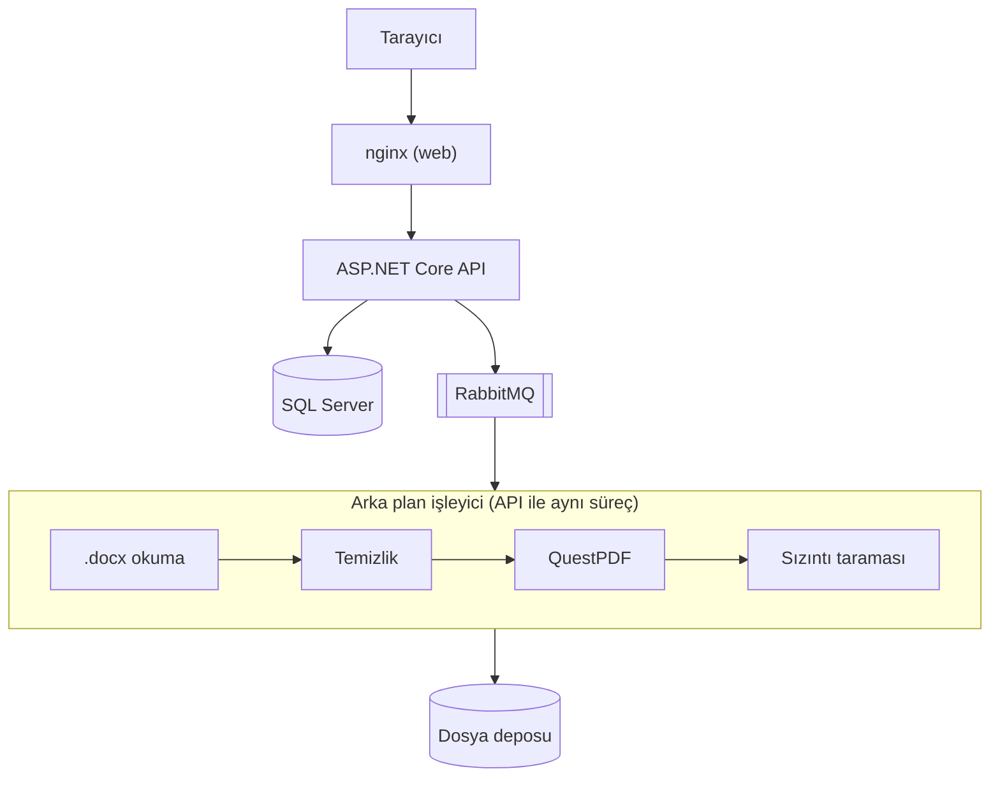
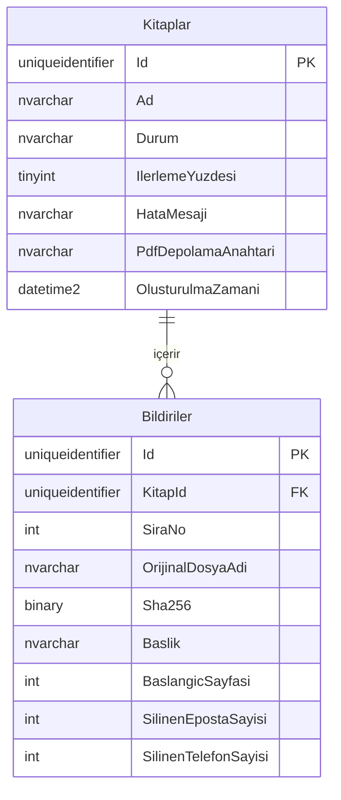

# Bildiri Kitabı

On Word (.docx) bildirisini, iletişim bilgileri temizlenmiş ve İçindekiler'i doğru sayfaları gösteren tek bir PDF e-kitapta birleştiren bir web uygulaması. Kitap tarayıcıda görüntülenir ve indirilir.


<a id="hizli-baslangic"></a>

## Hızlı başlangıç

Gereksinimler: Git, Docker Desktop (veya Docker Engine + Compose v2), en az 2 GB boş bellek.

1. Depoyu klonlayın:

   ```sh
   git clone https://github.com/suleymank12/bildiri-kitabi.git
   cd bildiri-kitabi
   ```

2. `.env` dosyasını rastgele parolalarla oluşturun:

   Windows (PowerShell):

   ```powershell
   powershell -ExecutionPolicy Bypass -File scripts\env-olustur.ps1
   ```

   macOS / Linux:

   ```sh
   sh scripts/env-olustur.sh
   ```

   `-ExecutionPolicy Bypass` yalnızca bu tek çalıştırmayı etkiler, sistem ayarını değiştirmez. Betik var olan bir `.env`'e dokunmaz.

3. Sistemi derleyip başlatın (ilk seferde birkaç dakika sürer):

   ```sh
   docker compose up --build -d
   ```

4. http://localhost:8080 adresini açın.

Denemek için case ile gönderilen 10 .docx dosyasını yükleyin. Sağlık durumu: http://localhost:8080/health.

Durdurmak için:

```sh
docker compose down      # konteynerler kaldırılır, veriler kalır
docker compose down -v   # veritabanı, kuyruk ve PDF'ler dahil her şey silinir
```

### Docker olmadan (MSSQL bağlantısı)

Gereksinimler: .NET 10 SDK, Node.js 22.12+, SQL Server (LocalDB yeterli). API bağlantı dizesini `ConnectionStrings:Default` anahtarından okur; Development ortamındaki varsayılan LocalDB'dir:

```text
Server=(localdb)\MSSQLLocalDB;Database=BildiriKitabi;Trusted_Connection=True;TrustServerCertificate=True
```

Başka bir sunucu için dizeyi `ConnectionStrings__Default` ortam değişkeniyle verin. API Development ortamında açılışta migration'ları uygular; elle uygulamak için `backend` klasöründe `dotnet ef database update --project src/BildiriKitabi.Infrastructure --startup-project src/BildiriKitabi.Api` çalıştırın. Ardından iki ayrı terminalde:

```sh
cd backend && dotnet run --project src/BildiriKitabi.Api   # API: http://localhost:5080
cd frontend && npm ci && npm run dev                       # arayüz: http://localhost:5173
```

Diğer sunucular, user-secrets, RabbitMQ ve yönetim arayüzü: [docs/kurulum.md](docs/kurulum.md).

## Nasıl kullanılır

1. Kitap adını yazın ve 10 .docx dosyasını yükleyin.
2. Tespit edilen başlıkları ve sırayı kontrol edin; gerekirse Yukarı / Aşağı düğmeleriyle değiştirin.
3. "Kitabı Oluştur"a basın; üretim bitince kitap görüntüleyicide açılır ve indirilebilir.

| 1. Yükleme | 2. Sıra ve kontrol | 3. Üretim |
|---|---|---|
|  |  |  |

## Tasarım kararları (masaüstü ve mobil)

- Üç adımlı akış: ad ve dosyalar → sıra ve kontrol → oluşturma ve görüntüleme. Üstte adım göstergesi vardır; adres kitaba bağlı olduğundan sayfa yenilense de akış kaldığı yerden sürer.
- Dosya listesi masaüstünde tablo, telefonda aynı bilgileri taşıyan kartlardır.
- Bekleme ekranı sunucudaki gerçek aşamaları ve yüzdeyi gösterir; yapay ilerleme yoktur.
- Görüntüleyici masaüstünde çift sayfa ve İçindekiler paneliyle açılır. Telefonda tek sayfa gösterilir; yakınlaştırma düğmeleri alttaki sabit araç çubuğundadır, çift dokunma %200'e yakınlaştırır.
- Erişilebilirlik: akışın tamamı klavyeyle kullanılır, dokunma hedefleri en az 44 px'tir, her ekran E2E testlerinde axe ile taranır.

Tüm ekranlar (mobil dahil) ve ayrıntılı kararlar: [docs/arayuz.md](docs/arayuz.md).

<a id="kabul-kriterleri"></a>

## Kabul kriterleri

Tüm test adlarıyla tam tablo: [docs/testler.md](docs/testler.md#kabul-kriterleri).

| Kriter | Nasıl karşılanıyor | Kanıt |
|---|---|---|
| Yüklenen Word belgeleri tek bir PDF olarak oluşturuluyor | Bildiriler sırayla okunur, temizlenir ve QuestPDF ile tek belgede dizilir. | `BookEndToEndTests.Every_paper_is_reproduced_word_for_word_without_contact_values`, E2E `mutlu yol` |
| İçindekiler'deki her başlık doğru başlangıç sayfasını gösteriyor | Numara dizgi sırasında QuestPDF'in bölüm özelliğiyle hesaplanır, tahmin yoktur. | `BookEndToEndTests.Every_table_of_contents_entry_points_to_the_page_where_the_paper_starts` |
| Kitap sayfalarında tutarlı sayfa numaraları var | Basılı numara fiziksel sayfa sırasıdır; kapak 1 sayılır, basılmaz. | `BookEndToEndTests.Every_page_after_the_cover_shows_its_physical_page_number` |
| E-posta ve telefonlar PDF'te görünmüyor, diğer içerik aynen korunuyor | Sunucuda temizlenir, üretilen PDF ayrıca taranır. | `ContactInfoSanitizerTests`, `BookEndToEndTests.Book_contains_no_email_addresses_or_turkish_phone_numbers` |
| React arayüzü masaüstünde ve dar mobil ekranda temel akışı sunuyor | Akış 1280 px ve 390 px genişlikte yatay kaydırmasız çalışır. | E2E `düzen: yatay kaydırma yok ve dokunma hedefleri en az 44 px` |
| MSSQL şeması migration ile kuruluyor, iki tablo arasındaki ilişki çalışıyor | EF Core migration'ları tabloları, cascade yabancı anahtarı ve kısıtları kurar. | `SchemaAndUploadTests.Migration_creates_the_tables_keys_and_constraints_on_an_empty_database` |
| Dosya saklama yaklaşımı çalışıyor ve açıklanıyor | `wwwroot` dışında, atomik yazımlı yerel depo; [aşağıda](#dosya-saklama) açıklanıyor. | `LocalFileStorageTests` |
| Bekleme, başarılı sonuç ve hata durumları arayüzde görülüyor | Gerçek aşama ve yüzde, sonuçta görüntüleyici, hatada mesaj ve tekrar dene. | E2E `bekleme ekranı erişilebilir`, E2E `üretim hatası: hata ekranı, tekrar dene ve sırayı düzenle` |
| Oluşturma başarısız olursa kitabın durumu `Failed` oluyor | Her hata `Durum = 'Failed'`, kod ve Türkçe mesajla kaydedilir. | `LifecycleTests.A_renderer_failure_marks_the_book_failed_and_a_retry_completes_it` |
| Tam olarak 10 adet .docx yükleniyor; dosya adı ve sıra görülüyor | Arayüzde ve sunucuda sayı, tür, boyut ve mükerrer kontrolü yapılır. | `BookUploadValidatorTests.Nine_files_are_rejected`, E2E `istemci doğrulaması: eksik dosya, yanlış tür ve mükerrer dosya` |
| PDF web arayüzünde görüntüleniyor ve indiriliyor | react-pdf tabanlı görüntüleyici; İçindekiler paneli, yakınlaştırma ve indirme. | E2E `mutlu yol`, `PdfViewer.test.tsx` |

## Mimari

Tarayıcı yalnızca nginx'e bağlanır; nginx arayüzün statik dosyalarını verir ve `/api` isteklerini ASP.NET Core API'ye iletir. API kayıtları SQL Server'da, dosyaları yerel depoda tutar; üretim işleri RabbitMQ üzerinden aynı süreçteki arka plan işleyiciye gider. Katmanlar `Api → Infrastructure → Core` yönünde bağımlıdır.



Kuyruk, kurtarma, API uçları ve proje yapısı: [docs/mimari.md](docs/mimari.md). Word okuma, stil çözümleme ve kitap düzeni: [docs/word-pdf.md](docs/word-pdf.md).

## İşleme akışı

1. Yükleme ve doğrulama: kitap adı ve 10 dosya tek istekle gelir; sayı, tür, boyut, ZIP güvenliği ve mükerrer içerik denetlenir. Hata varsa hiçbir kayıt veya dosya kalmaz.
2. Başlık tespiti: sırasıyla Word'ün başlık stili, ilk beş paragraftaki ortalı ve tamamı kalın paragraf, dosya adı denenir; yedek yöntemle bulunan başlık arayüzde "kontrol edin" uyarısıyla işaretlenir.
3. Kayıt: kitap ve bildiriler tek transaction'da kaydedilir; kitap `Uploaded` olur.
4. Sıra: varsayılan sıra yükleme sırasıdır. İkinci adımda her satırdaki Yukarı / Aşağı düğmeleriyle değiştirilir ve hemen kaydedilir; sıra yükleme sırasından farklıysa arayüz bunu belirtir. İlk adımdaki "Ada göre sırala" dosyaları doğal sayı sırasına dizer (`2_…` önce, `10_…` sonra).
5. Kuyruk: "Kitabı Oluştur" kitabı `Queued` yapar ve kuyruğa yalnızca kitap kimliğini koyar; işleyici kitabı sahiplenince durum `Processing` olur.
6. Üretim: bildiriler okunur, iletişim bilgileri temizlenir, QuestPDF ile dizilir ve PDF sızıntıya karşı taranır. Sonunda kitap `Completed` olur ya da hata kodu ve Türkçe mesajla `Failed`.

## Veri modeli

Case'in istediği iki tablo vardır: `Kitaplar` ve ona bağlı `Bildiriler` (silmede cascade). Kolon adları Türkçe, C# sınıfları İngilizcedir (`Book`, `Paper`); durumlar metin olarak saklanır.



Tüm kolonlar, kısıtlar ve durum geçişleri: [docs/veri-modeli.md](docs/veri-modeli.md).

<a id="dosya-saklama"></a>

## Dosya saklama

- Dosyalar `IFileStorage` arkasındaki `LocalFileStorage` ile yerel diskte durur: yerelde `App_Data/storage`, Docker'da `storage` volume'una bağlı `/data/storage`.
- `wwwroot` kullanılmaz, çünkü kaynak .docx'ler temizlenmemiş iletişim bilgisi içerir. PDF yalnızca API ucundan, kitap `Completed` olduğunda verilir.
- Anahtarları sistem üretir: `books/{kitapId}/sources/{bildiriId}.docx` ve `books/{kitapId}/output/book.pdf`. Kullanıcının dosya adı yol olarak kullanılmaz.
- Yazım atomiktir: içerik geçici dosyaya yazılır, sonra hedefin yerine taşınır.
- Her anahtar kök klasöre göre çözülür; kökün dışına çıkan anahtar reddedilir (yol aşımı savunması).

## İletişim bilgisi temizliği

- Sunucuda, her paragrafta yalnızca e-posta ve telefon değerleri silinir; paragrafın geri kalanı ve biçimi (kalın, italik) korunur.
- Değere bağlı etiketler (`E-posta:`, `Tel:`, `GSM` …) ve artık ayırıcılar (`|`, `/`, `;`) da silinir; tamamen boşalan paragraf kaldırılır.
- ORCID, ISBN, DOI, tarih, yıl aralığı, tutar ve IBAN gibi numaralar telefon sayılmaz, aynen kalır.
- Telefon adayları rakamlara indirgenip Türkiye (10 hane) ve uluslararası (`+`, 8–15 hane) kurallarıyla doğrulanır; gizlenmiş e-postalar (`ad [at] alan.edu.tr`) da bulunur.
- Üretilen PDF'in metni ayrıca taranır; eşleşme varsa PDF yayımlanmaz, kitap `Failed` (`CONTACT_LEAK_DETECTED`) olur.

| Kaynaktaki satır | PDF'teki sonuç |
|---|---|
| `E-posta: elif.kaya@example.org \| Tel: 0500 000 00 01 \| ORCID: 0000-0001-1000-0001` | `ORCID: 0000-0001-1000-0001` |
| `İletişim: selin.arslan@example.org - 0500-000-00-03 - ORCID 0000-0001-1000-0003` | `ORCID 0000-0001-1000-0003` |
| `nazli.er@example.org / Tel.No: 0 500 000 00 07` | *(paragraf kaldırılır)* |

Örnek bildirilerde 13 e-posta, 13 telefon silinir; 3 ORCID korunur.

Örnek testler:

- `Sample_contact_lines_are_cleaned_exactly`: örnek dosyalardaki 13 iletişim satırı beklenen sonuçla birebir karşılaştırılır.
- `Non_contact_numbers_are_kept_verbatim`: ORCID, ISBN, DOI, tarih, tutar ve IBAN değişmeden kalır.
- `Email_split_across_runs_is_removed_and_neighbouring_formatting_is_kept`: iki run'a bölünmüş e-posta silinir, komşu metnin kalınlığı korunur.
- `Generation_fails_with_contact_leak_code_when_the_rendered_pdf_still_contains_contact_values`: PDF'te iletişim bilgisi kalırsa üretim başarısız olur.

Tam kurallar, 13 satırın tamamı ve kitap adıyla ilgili kural: [docs/iletisim-temizligi.md](docs/iletisim-temizligi.md).

## Testler

| Komut | Kapsam | Sayı |
|---|---|---|
| `cd backend && dotnet test` | Birim ve entegrasyon testleri (uçtan uca PDF, SQL Server, RabbitMQ, API) | 414 |
| `cd frontend && npm run test` | Bileşen ve birim testleri (Vitest) | 269 |
| `cd frontend && npm run test:e2e` | Playwright, masaüstü ve mobil, gerçek API ile | 16 |
| `cd frontend && npm run test:e2e:docker` | Aynı E2E testleri Docker kurulumuna karşı | 16 |

SQL Server ve RabbitMQ gerektiren entegrasyon testleri Testcontainers kullanır; Docker yoksa nedeni yazılarak atlanır. Örnek bildirilere dayanan testler için dosyaları `testdata/bildiriler/` klasörüne kopyalayın; dosyalar yoksa bu testler nedeni yazılarak atlanır. Ayrıntılar: [docs/testler.md](docs/testler.md).

## Kütüphaneler ve lisanslar

| Kütüphane | Amaç | Lisans |
|---|---|---|
| EF Core 10 | Veri erişimi ve migration | MIT |
| Open XML SDK (DocumentFormat.OpenXml) | .docx okuma | MIT |
| QuestPDF | PDF dizgisi | QuestPDF Community License |
| UglyToad.PdfPig | PDF metin çıkarma (sızıntı taraması) | Apache-2.0 |
| RabbitMQ.Client | Kuyruk | Apache-2.0 / MPL-2.0 |
| React 19 | Arayüz | MIT |
| react-pdf / pdf.js | PDF görüntüleyici | MIT / Apache-2.0 |

QuestPDF Community lisansı bireyler, açık kaynak projeler ve yıllık brüt geliri 1 milyon USD'nin altındaki kuruluşlar için ücretsizdir; üstündeki kuruluşlarda ücretli lisans gerekir. Tam liste, yazı tipleri ve konteyner imajları: [docs/kutuphaneler.md](docs/kutuphaneler.md).

## Bilinen sınırlamalar

- Kimlik doğrulama yok; uygulamaya erişen herkes tüm kitapları görebilir ve silebilir.
- Word biçim sadakati sınırlı: görseller, liste numaraları ve yazı rengi PDF'e taşınmaz.
- Docker kurulumu yerel değerlendirme içindir; TLS içermez, yalnızca `127.0.0.1` üzerinde yayımlanır.
- PDF'te yer imleri (outline) yok; gezinme İçindekiler bağlantılarıyla yapılır.
- Kitap adına yazılan iletişim bilgisi temizlenmez, çünkü kural Word içeriği içindir.
- Yüklenip hiç oluşturulmayan kitapların dosyaları otomatik silinmez; kullanıcı "Sil" ile kaldırabilir.

Tam liste ve güvenlik notları: [docs/sinirlamalar.md](docs/sinirlamalar.md).

<a id="yapay-zeka"></a>

## Yapay zekâ kullanımı

Bu projede yapay zekâ araçlarından yoğun biçimde yararlandım. Case'in analizi, mimari ve aşama planı Claude ile birlikte çıkarıldı; kodun büyük bölümü, her aşama için hazırlanan talimatlarla Claude Code tarafından yazıldı. Her aşamanın sonunda üretilen kodu ve çıktıları inceledim, uygulamayı elle test ettim ve kapsam kararlarını ben verdim (ör. kitap adındaki iletişim bilgisinin serbest bırakılması, RabbitMQ ve Docker'ın kapsama alınması, commit ve arayüz dilinin Türkçe olması). Doğruluk; üretilen PDF'i bağımsız olarak okuyan uçtan uca testler, gerçek SQL Server ve RabbitMQ konteynerleriyle çalışan entegrasyon testleri ve masaüstü/mobil tarayıcı testleriyle doğrulandı. Kodun her bölümünü açıklayabilecek şekilde inceledim ve sorumluluğunu üstleniyorum.

## Ayrıntılı belgeler

- [Kurulum](docs/kurulum.md): Docker kurulumunun uzun hali, Docker olmadan çalıştırma, MSSQL bağlantısı, şema, kuyruk sağlayıcısı.
- [Mimari](docs/mimari.md): katmanlar, işleme akışı, kuyruk ve arka plan işleme, API uçları, proje yapısı.
- [Veri modeli](docs/veri-modeli.md): kolon tabloları, kısıtlar ve durum geçişleri.
- [Word → PDF işleme](docs/word-pdf.md): okunan öğeler, stil çözümleme, başlık tespiti, kitap düzeni, yazı tipleri.
- [İletişim bilgisi temizliği](docs/iletisim-temizligi.md): tam kurallar, 13 satırlık önce/sonra tablosu, kitap adı kuralı, örnek testler.
- [Arayüz](docs/arayuz.md): tasarım kararları ve tüm ekran görüntüleri.
- [Testler](docs/testler.md): test komutları, Docker gerektirenler, kabul kriterlerinin test adlarıyla tam hali.
- [Kütüphaneler](docs/kutuphaneler.md): tüm kütüphaneler, yazı tipleri, konteyner imajları, lisans notları.
- [Güvenlik ve sınırlamalar](docs/sinirlamalar.md): güvenlik notları ve bilinen eksiklerin tam listesi.
