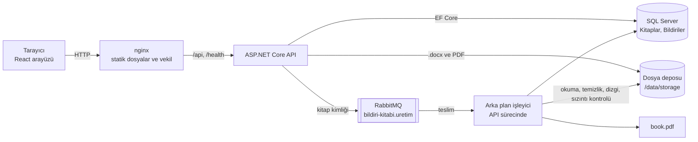

# Mimari

← [README](../README.md)

## Genel bakış

Bildiri Kitabı, aynı etkinliğe ait on Word (.docx) bildirisini tek bir PDF e-kitapta birleştiren bir web uygulamasıdır. Kitapta kapak, gerçek başlangıç sayfalarını gösteren bir İçindekiler ve tutarlı sayfa numaraları bulunur; e-posta adresleri ile telefon numaraları sunucu tarafında temizlenir, sonuç tarayıcıdaki görüntüleyicide açılır ve indirilir.



Katmanlar ve bağımlılık yönü `Api → Infrastructure → Core`:

| Katman | Sorumluluk |
|---|---|
| `BildiriKitabi.Core` | Etki alanı (`Book`, `Paper`, durumlar), belge modeli, iletişim bilgisi temizliği, başlık tespiti, yükleme doğrulaması, uygulama servisleri ve arayüzler (`IDocxReader`, `IFileStorage`, `IBookGenerationQueue` vb.). Hiçbir altyapı paketine (EF sağlayıcısı, OpenXML, QuestPDF, RabbitMQ) bağımlı değildir. |
| `BildiriKitabi.Infrastructure` | EF Core `DbContext`, yapılandırmalar ve migration'lar; OpenXML ile .docx okuma; QuestPDF ile dizgi; PdfPig ile sızıntı taraması; yerel dosya deposu; süreç içi ve RabbitMQ kuyruk sağlayıcıları; gömülü yazı tipleri. |
| `BildiriKitabi.Api` | Controller'lar, ProblemDetails hata biçimi, rate limiting, güvenlik başlıkları, sağlık kontrolü, arka plan işleyici, açılış kurtarması ve kuyruk süpürücüsü. |

API ve arka plan işleyici aynı süreçte çalışır; kuyruk bir arayüzün arkasında olduğundan işleyici ayrı bir sürece taşınabilir.

Docker'da açılış sırası: `mssql` sağlık kontrolü yalnızca bağlantı kabul edilmesine değil, `BildiriKitabi` veritabanı varsa gerçekten okunabilmesine (kurtarmanın bitmesine) bakar; `db-init` ve API bu kontrolden sonra başlar. `db-init` yine de SQL Server'a ulaşamazsa yaklaşık 60 sn boyunca 2 sn arayla yeniden dener (yanlış `sa` parolasında hemen durur). API de açılıştaki migration'dan önce veritabanını bekler: geçici SQL hatalarında üstel geri çekilmeyle yaklaşık 60 sn yeniden dener, kalıcı hatalarda (ör. hatalı giriş) hemen durur; bu sayede Docker veya bilgisayar yeniden başladığında API'nin SQL Server'dan önce kalkması sorun olmaz. Parolalar `sqlcmd`'ye komut satırıyla değil ortam değişkeniyle verilir. nginx API'nin adresini açılışta bir kez değil, Docker'ın DNS'i üzerinden çalışma anında çözer; yeniden başlatmalarda API'nin IP adresi değişse de web konteynerine dokunmadan çalışmaya devam eder.

<a id="isleme-akisi"></a>

## İşleme akışı

1. **Yükleme** — Arayüz kitap adını ve on dosyayı tek bir `multipart/form-data` isteğiyle gönderir; yükleme ilerlemesi gösterilir. Dosyalar önce geçici bir klasöre yazılır.
2. **Doğrulama** — Kitap adı, dosya sayısı, uzantı, ZIP imzası, Word ana parça türü, boyut sınırları, ZIP bombası ve mükerrer içerik (SHA-256) denetlenir. Tüm sorunlar dosya bazında, Türkçe mesajlarla tek seferde döner; hata varsa hiçbir kayıt veya dosya kalmaz.
3. **Başlık tespiti** — Her bildiri ayrıştırılır ve başlığı bulunur (sıra aşağıda); başlık ve kaynağı yanıtta döner.
4. **Kayıt** — Kitap ve bildiriler tek transaction'da kaydedilir, dosyalar kalıcı konumlarına taşınır. Kitabın durumu `Uploaded` olur.
5. **Sıra** — Varsayılan sıra yükleme sırasıdır. İkinci adımda her satırdaki Yukarı / Aşağı düğmeleriyle değiştirilebilir ve her değişiklik hemen kaydedilir; sıra yükleme sırasından farklıysa arayüz bunu belirtir.
6. **Kuyruk** — "Kitabı Oluştur" isteği kitabı `Queued` yapar ve kuyruğa yalnızca kitap kimliğini koyar; API hemen `202 Accepted` döner.
7. **Okuma** — İşleyici kitabı `Processing` olarak sahiplenir, bildirileri sırayla okuyup belge modeline çevirir.
8. **Temizlik** — Her paragraftan e-posta ve telefon değerleri ile bunlara bağlı etiketler ve ayırıcılar silinir; bildiri başına silinen sayılar kaydedilir.
9. **Dizgi** — Kapak, İçindekiler ve bildiriler QuestPDF ile tek PDF'te dizilir; bildirilerin başlangıç ve bitiş sayfaları kaydedilir.
10. **Sızıntı kontrolü** — Üretilen PDF'in metni PdfPig ile çıkarılıp e-posta ve telefon desenleriyle yeniden taranır. Eşleşme varsa PDF yayımlanmaz, kitap `Failed` (`CONTACT_LEAK_DETECTED`) olur.
11. **Kaydetme** — PDF atomik olarak depoya yazılır; kitap `Completed` olur, sayfa sayısı ve PDF boyutu kaydedilir. Arayüz durumu yoklayarak aşamaları gösterir ve tamamlanınca görüntüleyiciyi açar.

<a id="kuyruk"></a>

## Kuyruk ve arka plan işleme

Kuyruk `IBookGenerationQueue` arayüzünün arkasındadır; mesaj yalnızca kitap kimliğini (ve mesaj sürümünü) taşır. Durumun tek doğru kaynağı veritabanıdır.

- **Yayın:** "Kitabı Oluştur" kitabı `Queued` yapıp kaydeder, sonra mesajı yayımlar. RabbitMQ sağlayıcısı kalıcı (persistent) JSON mesajı dayanıklı `bildiri-kitabi.uretim` kuyruğuna publisher confirms ile gönderir; çağrı ancak broker onayladıktan sonra döner.
- **Tüketim:** API sürecindeki `BookGenerationWorker`, en fazla `Generation:MaxConcurrency` (varsayılan 2) işi aynı anda, her birini kendi DI kapsamında çalıştırır; RabbitMQ'da prefetch bu sayıya eşittir. İş başına zaman sınırı `Generation:TimeoutSeconds` (varsayılan 120 sn) aşılırsa kitap `GENERATION_TIMEOUT` koduyla `Failed` olur.
- **Onay (ack):** mesaj, işleyici döndükten sonra onaylanır (en az bir kez teslim). İşleyici idempotenttir: yalnızca hâlâ `Queued` olan kitap, tek bir işleyicinin kazanabileceği koşullu bir güncellemeyle sahiplenilir; ikinci kez teslim edilen mesaj zararsızdır.
- **DLQ:** işleyici beklenmedik bir istisna atarsa veya mesaj gövdesi geçersizse mesaj `bildiri-kitabi.uretim.dlq` ölü mektup kuyruğuna gider. Beklenen üretim hataları (bozuk belge, sızıntı, zaman aşımı) kitabı `Failed` yapar ve mesaj normal şekilde onaylanır.
- **Kesinti ve kurtarma:** uygulama bir işin ortasında durursa onaylanmamış mesaj yeniden teslim edilir; açılışta `Processing` kalmış kitaplar `Queued` durumuna döner ve bekleyen kitaplar yeniden kuyruğa eklenir. `QueuedBookSweeper`, `Generation:RequeueStaleAfterSeconds` süresinden uzun `Queued` bekleyen kitapları (ör. broker kapalıyken istenmiş olanları) yeniden kuyruğa ekler; veritabanı satırı basit bir outbox gibi çalışır.
- **Takılı kalan üretim:** süpürücü her turda, `Generation:TimeoutSeconds + Generation:RequeueStaleAfterSeconds` süresinden (varsayılan 180 sn) uzun süredir `Processing` olan kitapları da ele alır. Bu süre dolduğunda iş zaman sınırı nedeniyle çoktan bırakılmıştır; kitap orada kaldıysa sonucu yazılamamıştır (ör. hata anında veritabanına ulaşılamadı). Açılış kurtarmasıyla aynı yardımcı (`InterruptedGenerationRecovery`) kullanılır: kitap bir kez daha kuyruğa alınır; aynı deneme yeniden takılırsa kitap `Failed` olur (`GENERATION_INTERRUPTED`, "Kitap oluşturma yarıda kaldı. Lütfen tekrar deneyin."). Güncelleme satır sürümüyle (`SatirVersiyonu`) koşulludur; bu arada ilerleme yazan canlı bir iş varsa kayda dokunulmaz. "Bir kez daha" bilgisi için yeni kolon eklenmedi: kurtarma, yarıda kalan çalışmanın bitişini `IslemBitisZamani` alanına yazar; devam eden bir çalışmada bu alan normalde boştur ve kullanıcı "Kitabı Oluştur" veya "Tekrar dene" dediğinde temizlenir. İşleyicinin hata yazma adımı da iptal dışındaki hiçbir istisnayı dışarı sızdırmaz.
- **Süreç içi sağlayıcı:** Docker'sız yerel geliştirmede varsayılan olan `InMemory` sağlayıcısı sınırlı bir `Channel` kullanır; mesajlar süreçle birlikte kaybolur ama açılış kurtarması ve süpürücü bekleyen her kitabı yeniden kuyruğa ekler.
- **Sağlık:** `/health`, RabbitMQ sağlayıcısı seçildiğinde bağlantı kontrolünü de içerir.

MassTransit yerine doğrudan `RabbitMQ.Client` kullanıldı: tek kuyruk ve tek mesaj türü için gereken topoloji (kalıcı kuyruk, DLX/DLQ, publisher confirms, elle onay) birkaç yüz satırdır ve her adımı görünür kalır. MassTransit'in güncel ana sürümü ticari lisansa geçmiştir; ek bir soyutlama katmanı ve lisans yükü bu kapsam için gerekçelendirilemedi.

<a id="dosya-saklama"></a>

## Dosya saklama yaklaşımı

- Dosyalar `IFileStorage` arayüzü arkasındaki `LocalFileStorage` ile yerel diskte saklanır. Kök klasör `Storage:RootPath` ayarıdır: yerelde `App_Data/storage` (API'nin içerik kökünün altında), Docker'da `storage` volume'una bağlı `/data/storage`.
- `wwwroot` kullanılmaz: kaynak .docx dosyaları temizlenmemiş iletişim bilgisi içerir ve statik dosya olarak herkese açık servis edilmemelidir. PDF yalnızca API ucu üzerinden, kitap `Completed` olduğunda verilir. Orijinal .docx'i indiren bir uç yoktur.
- Anahtarlar sistem tarafından üretilir: `books/{kitapId}/sources/{bildiriId}.docx` ve `books/{kitapId}/output/book.pdf`. Kullanıcının dosya adı hiçbir zaman yol olarak kullanılmaz; yalnızca `OrijinalDosyaAdi` kolonunda gösterim için tutulur.
- Yazım atomiktir: içerik aynı klasörde geçici bir dosyaya yazılır, sonra hedefin yerine taşınır. Yarım kalan yazım önceki dosyayı bozmaz.
- Yol aşımı (path traversal) savunması: her anahtar kök klasöre göre çözülür ve kökün dışına çıkan anahtar reddedilir.
- Kitap silindiğinde veritabanı kayıtlarıyla birlikte `books/{kitapId}/` klasörü de silinir.

<a id="api"></a>

## API

| Metot | Yol | Açıklama | Başlıca yanıtlar |
|---|---|---|---|
| `POST` | `/api/books` | `multipart/form-data`: `name` ve tam 10 `files`. Doğrular, başlıkları tespit eder, kaydeder. | `201` kitap ayrıntısı; `400` dosya bazında hatalar; `413`; `429` |
| `GET` | `/api/books` | Kitapların listesi, en yeni önce; sayfalı. | `200` |
| `GET` | `/api/books/{id}` | Durum, aşama, yüzde, bildiriler, başlıklar, sayfa aralıkları, silinen sayılar, hata. | `200`; `404` |
| `PUT` | `/api/books/{id}/paper-order` | Bildiri sırasını değiştirir (yalnızca `Uploaded` veya `Failed`). | `200`; `400`; `404`; `409` |
| `POST` | `/api/books/{id}/generate` | Üretimi kuyruğa alır (yalnızca `Uploaded` veya `Failed`); çift istekte biri kazanır. | `202`; `404`; `409`; `429` |
| `GET` | `/api/books/{id}/pdf` | Üretilen PDF; aralık istekleri (`206`), `ETag`/`304`. `?download=true` indirme olarak verir (`Content-Disposition`, ASCII ve RFC 5987 `filename*`). | `200`/`206`/`304`; `404`; `409` |
| `DELETE` | `/api/books/{id}` | Kitabı, bildirilerini ve dosyalarını siler (kuyrukta veya işlenirken değil). | `204`; `404`; `409` |
| `GET` | `/health` | Veritabanı ve (seçiliyse) RabbitMQ sağlık raporu, JSON. | `200`; `503` |

Hata biçimi: tüm hatalar `application/problem+json` (RFC 9457) olarak döner. `detail` kullanıcıya gösterilebilecek Türkçe mesajdır, `code` makine okunur koddur (ör. `PAPER_COUNT_INVALID`, `FILE_DUPLICATE`, `GENERATION_ALREADY_IN_PROGRESS`, `BOOK_NOT_COMPLETED`). Yükleme hataları ayrıca dosya bazında bir `errors` listesi taşır. İstemciye yığın izi (stack trace) verilmez.

Rate limiting: istemci IP'si başına dakikalık sabit pencere; yükleme için 10, üretim için 20 istek (`RateLimiting:*` ayarları). Aşıldığında `429` ve `RATE_LIMITED` kodu döner. Docker kurulumunda istemci IP'si nginx'in `X-Forwarded-For` başlığından, yalnızca kurulumun kendi ağından gelen isteklerde okunur.

Development ortamında OpenAPI belgesi `/openapi/v1.json`, etkileşimli referans `/scalar` adresindedir; Production'da (Docker) kapalıdır.

<a id="proje-yapisi"></a>

## Proje yapısı

```text
bildiri-kitabi/
├─ backend/
│  ├─ src/
│  │  ├─ BildiriKitabi.Api/            Controller'lar, hata biçimi, rate limiting, arka plan işleyici, açılış
│  │  ├─ BildiriKitabi.Core/           Etki alanı, belge modeli, temizlik, başlık tespiti, doğrulama, servisler
│  │  └─ BildiriKitabi.Infrastructure/ EF Core ve migration'lar, .docx okuma, PDF dizgisi, sızıntı taraması,
│  │                                   dosya deposu, kuyruk sağlayıcıları, gömülü yazı tipleri
│  ├─ tests/
│  │  ├─ BildiriKitabi.UnitTests/
│  │  ├─ BildiriKitabi.IntegrationTests/
│  │  └─ Shared/                       Testlerde ortak yardımcılar (örnek .docx üretimi, yollar)
│  ├─ database/schema.sql              Migration'lardan üretilmiş idempotent SQL betiği
│  └─ Dockerfile
├─ frontend/
│  ├─ src/
│  │  ├─ api/                          Tipli API istemcisi, sorgu kancaları, hata eşleme
│  │  ├─ app/                          Uygulama iskeleti, yönlendirme, sayfa düzeni
│  │  ├─ components/ui/                Tasarım sistemi bileşenleri
│  │  ├─ features/                     Yeni kitap, kitap sayfası ve üretim, görüntüleyici, Kitaplarım
│  │  ├─ lib/                          Biçimlendirme ve yardımcı işlevler
│  │  └─ styles/                       Tema ve renk belirteçleri
│  ├─ e2e/                             Playwright testleri ve ekran görüntüsü üretimi
│  ├─ nginx.conf                       Docker'daki web sunucusu ve API vekili
│  └─ Dockerfile
├─ docker/db-init.sql                  Veritabanını ve uygulama girişini oluşturan betik
├─ docker/db-init.sh                   db-init'in sınırlı yeniden deneme döngüsü
├─ docs/                              Ayrıntılı belgeler (kurulum, mimari, veri modeli, testler …)
├─ scripts/env-olustur.ps1, .sh        .env'i rastgele parolalarla oluşturan betikler
├─ testdata/bildiriler/                Case'in 10 örnek bildirisi buraya kopyalanır (şirkete ait, git'te yok)
├─ docker-compose.yml
└─ .env.example
```
