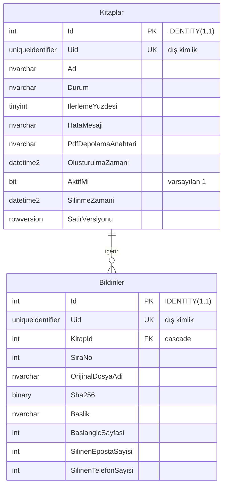
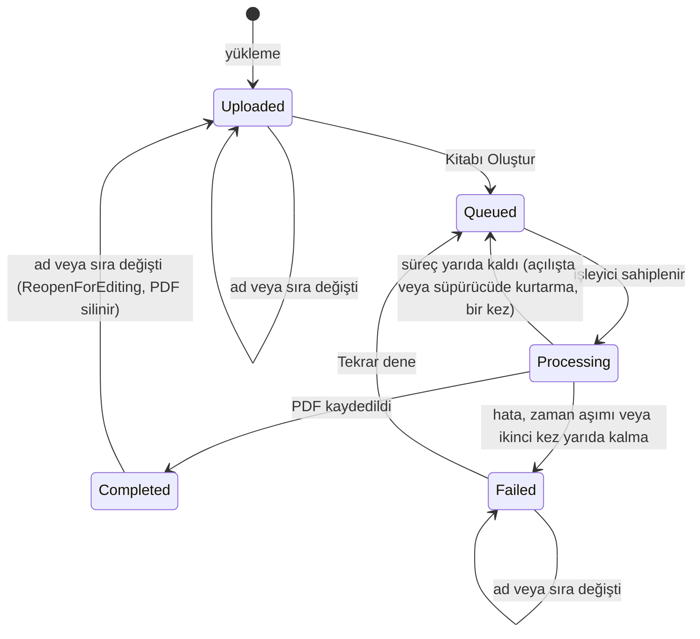
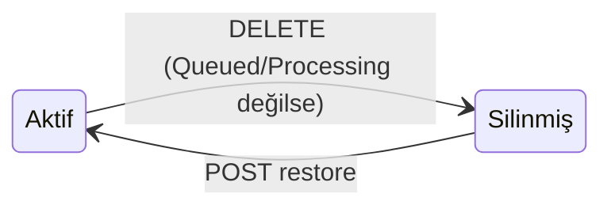

# Veri modeli

← [README](../README.md)

Tablo ve kolon adları Türkçe, C# sınıfları İngilizcedir (`Book` → `Kitaplar`, `Paper` → `Bildiriler`); eşleme `IEntityTypeConfiguration` sınıflarında açıkça yapılır. Durum ve aşama değerleri metin olarak saklanır.

Şema tek bir migration'dan (`InitialCreate`) kurulur; aynı şemanın EF araçları gerektirmeyen idempotent SQL hâli [`backend/database/schema.sql`](../backend/database/schema.sql) dosyasındadır.

## İki kimlik: `Id` ve `Uid`

Her tabloda iki kimlik vardır:

- **`Id`** (`int IDENTITY(1,1)`): kümelenmiş birincil anahtar ve yabancı anahtarların hedefi. Yalnızca veritabanı içinde, anahtar ve birleştirme için kullanılır. Tahmin edilebilir olduğu için uygulamanın dışına hiç çıkmaz.
- **`Uid`** (`uniqueidentifier`, benzersiz indeksli): dış kimlik. Değerini uygulama, kayıt bağlama eklenirken EF Core'un sıralı GUID üreticisiyle (`SequentialGuidValueGenerator`) verir. API adresleri (`/api/books/{uid}`), istek ve yanıt gövdeleri, kuyruk mesajları, loglar ve dosya deposu anahtarları (`books/{uid}/…`) yalnızca bunu kullanır. API yanıtlarındaki alan adı `id` olarak kaldı, değeri `Uid`'dir.

Etki alanında da iki ayrı özellik vardır: `Book.Id`/`Paper.Id` (int) ve `Book.Uid`/`Paper.Uid` (Guid). Guid v7 kullanılmadı: SQL Server `uniqueidentifier` değerlerini son altı bayttan başlayarak sıraladığı için v7 değerleri indekse rastgele düşer.

## Genel bakış

## `Kitaplar`

| Kolon | Tip | Açıklama |
|---|---|---|
| `Id` | `int IDENTITY(1,1)` PK | Veritabanı kimliği; dışarı çıkmaz |
| `Uid` | `uniqueidentifier`, benzersiz | Dış kimlik; uygulama üretir (sıralı GUID) |
| `Ad` | `nvarchar(150)` | Kitap adı, kullanıcının yazdığı gibi |
| `Durum` | `nvarchar(20)` | `Uploaded`, `Queued`, `Processing`, `Completed`, `Failed` |
| `Asama` | `nvarchar(20)` NULL | `Reading`, `Sanitizing`, `Composing`, `Rendering`, `Verifying`, `Saving` |
| `IlerlemeYuzdesi` | `tinyint` | 0–100, gerçek işten hesaplanır |
| `HataKodu` | `nvarchar(50)` NULL | Makine okunur kod (ör. `CONTACT_LEAK_DETECTED`) |
| `HataMesaji` | `nvarchar(500)` NULL | Kullanıcıya gösterilen Türkçe mesaj |
| `PdfDepolamaAnahtari` | `nvarchar(260)` NULL | Üretilen PDF'in depo anahtarı |
| `PdfBoyutuBayt` | `bigint` NULL | |
| `SayfaSayisi` | `int` NULL | |
| `OlusturulmaZamani` | `datetime2` | Varsayılan `sysutcdatetime()` |
| `KuyrugaAlinmaZamani` | `datetime2` NULL | Süpürücünün uzun bekleyen kitapları bulması için |
| `IslemBaslangicZamani`, `IslemBitisZamani` | `datetime2` NULL | |
| `AktifMi` | `bit`, varsayılan `1` | `0`: kitap silindi (pasif). Kayıt, bildirileri ve dosyaları durur |
| `SilinmeZamani` | `datetime2` NULL | Silinme anı; aktif kitapta boş |
| `SatirVersiyonu` | `rowversion` | İyimser eşzamanlılık (çift tıklama, eşzamanlı istekler, çakışan düzenlemeler) |

Kısıtlar: `IlerlemeYuzdesi BETWEEN 0 AND 100`; `Durum` yalnızca tanımlı değerler; `Durum = 'Completed'` ise `PdfDepolamaAnahtari` dolu; `Durum = 'Failed'` ise `HataMesaji` dolu; `AktifMi = 1` ise `SilinmeZamani` boş, `AktifMi = 0` ise dolu (`CK_Kitaplar_Silinme`). Düzenlemeyle yeniden açılan kitap `Uploaded` olur ve PDF kolonları boşalır; `CK_Kitaplar_Tamamlandi_Pdf` yalnızca `Completed` durumunu bağladığı için buna izin verir. İndeksler: `Uid` (benzersiz), `Durum`, `OlusturulmaZamani DESC`.

**Silinmiş kitaplar ve global sorgu filtresi:** `Book` için EF Core'da adlı bir global sorgu filtresi (`ActiveBooks`: `AktifMi = 1`) tanımlıdır (`BookConfiguration`). `Books` kümesinden başlayan her sorgu, dolayısıyla detay, PDF, üretim, sıra, düzenleme uçları, arka plan işleyici, süpürücü ve açılış kurtarması silinmiş kitabı görmez. Kodun başka hiçbir yerinde `AktifMi` için elle koşul yazılmaz. Filtreyi yalnızca silinenler listesi ve geri alma bilinçli olarak atlar; ikisi de aynı yardımcıyı kullanır (`BookQueryFilters.Deleted`, `IgnoreQueryFilters(["ActiveBooks"])`). Bildirilerin ayrı bir aktiflik kolonu yoktur. Uygulama bildirilere yalnızca kitap üzerinden ulaşır (`IAppDbContext`'te bildiri kümesi yok), bu yüzden kitap filtresi bildirileri de kapsar.

## `Bildiriler`

| Kolon | Tip | Açıklama |
|---|---|---|
| `Id` | `int IDENTITY(1,1)` PK | Veritabanı kimliği; dışarı çıkmaz |
| `Uid` | `uniqueidentifier`, benzersiz | Dış kimlik (API'de bildiri `id`'si, depo anahtarında dosya adı) |
| `KitapId` | `int` FK → `Kitaplar.Id` | Silmede cascade (kitap satırı yalnızca elle silinirse; uygulama kitabı pasife alır) |
| `SiraNo` | `int` | Kitaptaki sıra (≥ 1) |
| `YuklemeSirasi` | `int` | Değişmeyen yükleme sırası (≥ 1) |
| `OrijinalDosyaAdi` | `nvarchar(255)` | Yalnızca gösterim için; yol olarak kullanılmaz |
| `DepolamaAnahtari` | `nvarchar(260)` | Kaynak .docx'in depo anahtarı |
| `DosyaBoyutuBayt` | `bigint` | |
| `Sha256` | `binary(32)` | Mükerrer dosya tespiti |
| `Baslik` | `nvarchar(500)` | Tespit edilen başlık, olduğu gibi |
| `BaslikKaynagi` | `nvarchar(20)` | `TitleStyle`, `FirstBoldParagraph`, `FileName` |
| `BaslangicSayfasi`, `BitisSayfasi` | `int` NULL | Üretimden sonra dolar; kitap düzenlemeyle yeniden açılınca boşalır |
| `SilinenEpostaSayisi`, `SilinenTelefonSayisi` | `int` | Varsayılan 0; yeniden açılınca 0'a döner |
| `YuklenmeZamani` | `datetime2` | |

Benzersiz indeksler: `Uid`, `(KitapId, SiraNo)` ve `(KitapId, Sha256)` — aynı dosya bir kitaba iki kez eklenemez. "Tam olarak 10 bildiri" kuralı uygulama katmanında (`Books:RequiredPaperCount`) uygulanır.

## Durum geçişleri

Başarısız üretimde kayıt `Durum = 'Failed'` olur; `HataKodu` ve `HataMesaji` doldurulur (veritabanı kısıtı mesajsız başarısızlığa izin vermez).

**Düzenleme:** kitabın adı (`PUT /api/books/{uid}`) ve bildiri sırası (`PUT /api/books/{uid}/paper-order`) `Uploaded`, `Failed` ve `Completed` durumlarında değiştirilebilir. Geçiş `Book.ReopenForEditing` metodundadır. Oluşmuş (`Completed`) kitap `Uploaded` durumuna döner. PDF depodan silinir; `PdfDepolamaAnahtari`, `PdfBoyutuBayt`, `SayfaSayisi`, işlem zamanları ile bildirilerin sayfa aralıkları ve silinen sayıları temizlenir. Kitap "Kitabı Oluştur" ile yeniden üretilir. `Uploaded` ve `Failed` kitap durumunu korur. Aynı ad veya aynı sıra gönderilirse hiçbir şey yazılmaz. `Queued` ve `Processing` kitap düzenlenemez (`409`). Kitap satırı her düzenlemede `SatirVersiyonu` denetimiyle yazılır; aynı kitabı aynı anda değiştiren iki istekten biri `409 EDIT_CONFLICT` alır.

**Silme ve geri alma:** silme durum değiştirmez. Kitap `AktifMi = 0` ve `SilinmeZamani = şimdi` olur (kuyrukta veya işlenirken silinemez). Silinmiş kitap Kitaplarım'da görünmez, API'nin normal uçları `404` döner ve arka plan işleri ona dokunmaz. Geri alındığında (`AktifMi = 1`, `SilinmeZamani = NULL`) silindiği durumla, PDF'i dahil, geri gelir.

