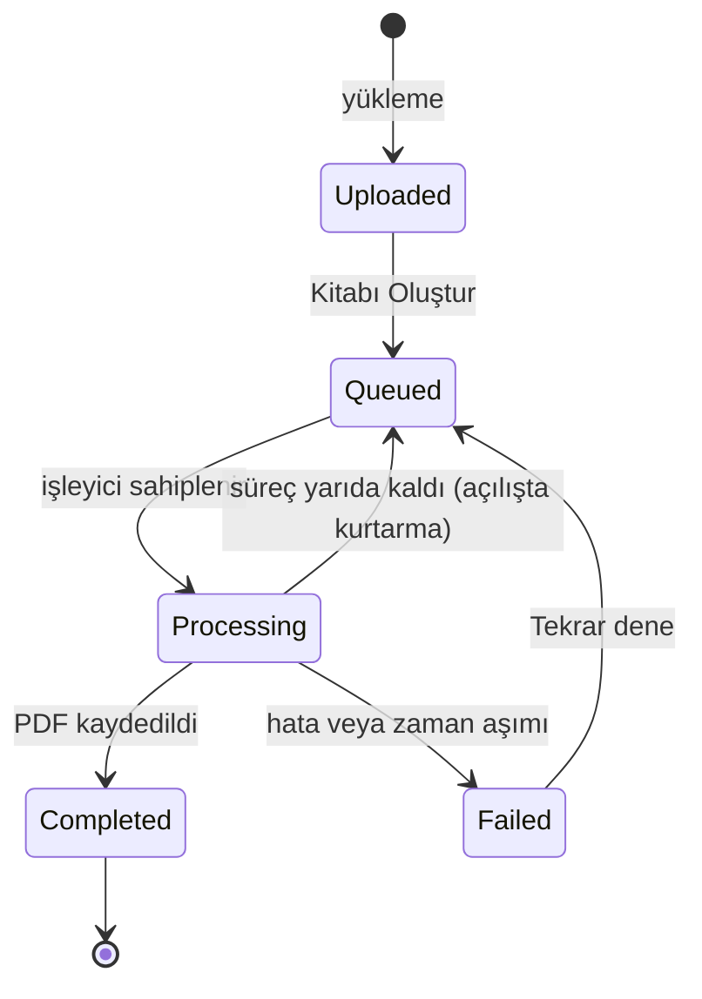

# Veri modeli

← [README](../README.md)

Tablo ve kolon adları Türkçe, C# sınıfları İngilizcedir (`Book` → `Kitaplar`, `Paper` → `Bildiriler`); eşleme `IEntityTypeConfiguration` sınıflarında açıkça yapılır. Durum ve aşama değerleri metin olarak saklanır.

## `Kitaplar`

| Kolon | Tip | Açıklama |
|---|---|---|
| `Id` | `uniqueidentifier` PK | EF Core'un SQL Server için sıralı GUID üreticisi (SequentialGuidValueGenerator); Guid v7 SQL Server'ın uniqueidentifier sıralamasında sıralı olmadığı için kullanılmadı |
| `Ad` | `nvarchar(150)` | Kitap adı, kullanıcının yazdığı gibi |
| `Durum` | `nvarchar(20)` | `Uploaded`, `Queued`, `Processing`, `Completed`, `Failed` |
| `Asama` | `nvarchar(20)` NULL | `Reading`, `Sanitizing`, `Composing`, `Rendering`, `Verifying`, `Saving` |
| `IlerlemeYuzdesi` | `tinyint` | 0–100, gerçek işten hesaplanır |
| `HataKodu` | `nvarchar(50)` NULL | Makine okunur kod (ör. `CONTACT_LEAK_DETECTED`) |
| `HataMesaji` | `nvarchar(500)` NULL | Kullanıcıya gösterilen Türkçe mesaj |
| `PdfDepolamaAnahtari` | `nvarchar(260)` NULL | Üretilen PDF'in depo anahtarı |
| `PdfBoyutuBayt` | `bigint` NULL | |
| `SayfaSayisi` | `int` NULL | |
| `OlusturulmaZamani` | `datetime2` | Varsayılan `sysutcdatetime()` |
| `KuyrugaAlinmaZamani` | `datetime2` NULL | Süpürücünün uzun bekleyen kitapları bulması için |
| `IslemBaslangicZamani`, `IslemBitisZamani` | `datetime2` NULL | |
| `SatirVersiyonu` | `rowversion` | İyimser eşzamanlılık (çift tıklama, eşzamanlı istekler) |

Kısıtlar: `IlerlemeYuzdesi BETWEEN 0 AND 100`; `Durum` yalnızca tanımlı değerler; `Durum = 'Completed'` ise `PdfDepolamaAnahtari` dolu; `Durum = 'Failed'` ise `HataMesaji` dolu. İndeksler: `Durum`, `OlusturulmaZamani DESC`.

## `Bildiriler`

| Kolon | Tip | Açıklama |
|---|---|---|
| `Id` | `uniqueidentifier` PK | |
| `KitapId` | `uniqueidentifier` FK → `Kitaplar.Id` | Silmede cascade |
| `SiraNo` | `int` | Kitaptaki sıra (≥ 1) |
| `YuklemeSirasi` | `int` | Değişmeyen yükleme sırası (≥ 1) |
| `OrijinalDosyaAdi` | `nvarchar(255)` | Yalnızca gösterim için; yol olarak kullanılmaz |
| `DepolamaAnahtari` | `nvarchar(260)` | Kaynak .docx'in depo anahtarı |
| `DosyaBoyutuBayt` | `bigint` | |
| `Sha256` | `binary(32)` | Mükerrer dosya tespiti |
| `Baslik` | `nvarchar(500)` | Tespit edilen başlık, olduğu gibi |
| `BaslikKaynagi` | `nvarchar(20)` | `TitleStyle`, `FirstBoldParagraph`, `FileName` |
| `BaslangicSayfasi`, `BitisSayfasi` | `int` NULL | Üretimden sonra dolar |
| `SilinenEpostaSayisi`, `SilinenTelefonSayisi` | `int` | Varsayılan 0 |
| `YuklenmeZamani` | `datetime2` | |

Benzersiz indeksler: `(KitapId, SiraNo)` ve `(KitapId, Sha256)` — aynı dosya bir kitaba iki kez eklenemez. "Tam olarak 10 bildiri" kuralı uygulama katmanında (`Books:RequiredPaperCount`) uygulanır.

## Durum geçişleri

Başarısız üretimde kayıt `Durum = 'Failed'` olur; `HataKodu` ve `HataMesaji` doldurulur (veritabanı kısıtı mesajsız başarısızlığa izin vermez). Başarısız kitabın sırası düzenlenip üretim yeniden başlatılabilir.
